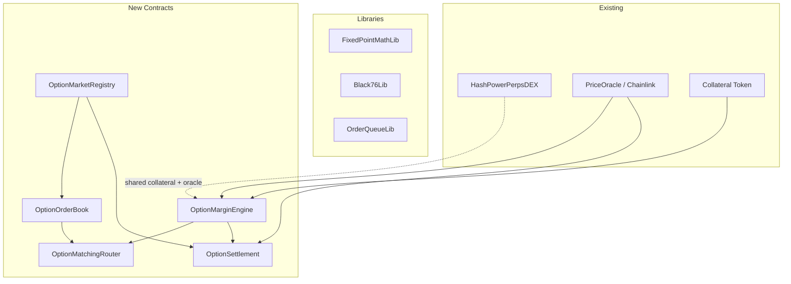

# Fully On-Chain CLOB Options on Perps

## Chat Summary

The research document explored options fundamentals, options-on-perps vs spot/futures, on-chain architecture patterns, MM churn reduction (skipped), Greeks-based margin, and settlement mechanics. Subsequent discussion refined: full on-chain Black-76 with polynomial CDF (no keeper for Greeks), order-book-derived IV with EWMA smoothing, and a modular contract architecture.

Key decisions:

- **European cash-settled** options on the perp mark/index price
- **Fully on-chain CLOB** with price-time priority per series
- **Black-76** pricing model (correct for perps/forward underlying)
- **On-chain Greeks** computed as `pure` functions from polynomial CDF approximation (Lyra-style hardcoded coefficients)
- **Order-book-derived IV** via Newton-Raphson on every fill, smoothed with EWMA to resist manipulation
- **Modular architecture** with 6 contracts + 3 libraries
- **No MM churn optimizations** (quote templates, block-based repricing) in this scope

---

## Architecture

Six contracts + three libraries, deployed alongside the existing `HashPowerPerpsDEX`. They share the same collateral token and oracle.



### Contract Responsibilities

- **OptionMarketRegistry** -- defines option series (strike, expiry, isCall, tick/lot sizes), lifecycle management (active/frozen/settled), binds to oracle
- **OptionOrderBook** -- per-series bid/ask books with linked-list FIFO queues, best bid/ask pointers, place/cancel, raw matching traversal
- **OptionMatchingRouter** -- orchestrates the full order lifecycle: pre-trade margin check, book traversal, premium cash flow, position updates, IV EWMA update, post-trade margin recheck; supports limit/IOC/FOK/postOnly
- **OptionMarginEngine** -- collateral custody (deposit/withdraw), per-account option positions, EWMA IV storage per series, on-chain Greeks via Black-76, stress-scenario IM/MM computation, health checks, resting order IM reservation, liquidation
- **OptionSettlement** -- freezes settlement reference at expiry, computes intrinsic payoffs, cash-settles all open positions, closes series

### Libraries

- **FixedPointMathLib** -- 18-decimal fixed-point `mul`, `div`, `exp`, `ln`, `sqrt` (adapted from solmate/Lyra)
- **Black76Lib** -- Black-76 call/put PV, normal CDF via rational polynomial (16 hardcoded coefficients), `d1`/`d2`, delta/gamma/vega, Newton-Raphson IV solver with bisection fallback
- **OrderQueueLib** -- doubly-linked FIFO queue operations for price levels

---

## Core Data Structures

```solidity
enum OptionType { CALL, PUT }
enum OrderSide { BUY, SELL }

struct OptionSeries {
    uint64 seriesId;
    uint64 strikeE8;            // strike price, 1e8 precision
    uint64 expiryTs;            // Unix timestamp
    bool isCall;
    uint32 tickSizeE8;          // premium tick size
    uint32 lotSize;             // minimum contract quantity
    uint256 initialIV;          // bootstrap IV set by admin (1e18)
    bool active;
    bool settled;
    uint256 settlementPrice;    // mark price frozen at expiry
}

struct Order {
    uint64 orderId;
    uint64 seriesId;
    address trader;
    bool isBuy;                 // true = buying premium (long option)
    uint64 priceTicks;          // premium limit in ticks
    uint128 size;               // total contracts
    uint128 remaining;          // unfilled contracts
    uint64 seq;                 // global monotonic counter for sub-block priority
    uint64 prev;                // DLL link
    uint64 next;                // DLL link
    bool postOnly;
    bool reduceOnly;
    bool active;
}

struct OptionPosition {
    int128 netQuantity;         // +long / -short
    uint128 avgPremiumE8;       // volume-weighted avg premium paid/received
}

struct IVState {
    uint256 ewmaIV;             // EWMA-smoothed implied vol (1e18)
    uint256 lastTradeBlock;     // block number of last IV update
    uint256 lastTradePremium;   // premium of last fill
}
```

---

## Black-76 On-Chain Library

Adapted from Lyra v1's battle-tested Solidity implementation. All functions are `pure` (zero storage reads for math).

**Normal CDF `N(x)`**: Rational polynomial approximation with 16 hardcoded constants (N0-N6, M0-M7) acting as a "lookup table" baked into bytecode. No SLOAD. Needs `exp(-x^2/2)` internally.

**Black-76 pricing** (differs from standard BS by using forward F instead of spot S):

```
d1 = (ln(F/K) + 0.5 * sigma^2 * T) / (sigma * sqrt(T))
d2 = d1 - sigma * sqrt(T)
call = D * (F * N(d1) - K * N(d2))
put  = D * (K * N(-d2) - F * N(-d1))
```

Where `F` = perp reference price (oracle mark), `D` = discount factor (= 1 for stablecoin collateral, simplifying to standard case).

**Greeks** (analytic from d1):

- `delta_call = D * N(d1)`, `delta_put = -D * N(-d1)`
- `gamma = D * N'(d1) / (F * sigma * sqrt(T))`
- `vega = D * F * N'(d1) * sqrt(T)`

**Newton-Raphson IV solver**: Given a target premium, iterates `sigma -= (B76(sigma) - target) / vega(sigma)`. Safeguards:

- Max 8 iterations
- Bisection fallback if NR diverges
- Output clamped to `[MIN_VOL=0.01e18, MAX_VOL=5e18]` (1% to 500%)
- Revert if premium < intrinsic value (no valid IV)

Gas: ~30-50k for Greeks, ~150-250k for IV solve.

---

## Order-Book Derived IV with EWMA Smoothing

IV is derived from market activity -- fully on-chain, no external oracle needed.

**Mechanism**:

1. Admin sets `initialIV` when creating a series (e.g., 0.5e18 = 50%)
2. On every fill, Newton-Raphson solves for `IV_trade` from the traded premium
3. EWMA smoothing prevents manipulation:

```
IV_new = alpha * IV_trade + (1 - alpha) * IV_old
```

where `alpha = 0.2` (configurable). A single manipulative trade can only move IV by ~20% of the distance to the manipulated value.

**Additional safeguards**:

- **Per-update clamp**: `|IV_new - IV_old|` capped at `maxIVChangeBps` (e.g., 500 bps = 5% absolute)
- **Min/max bounds**: IV clamped to `[1%, 500%]`
- **Minimum fill size**: fills below `minIVUpdateSize` (e.g., 1 lot) do not update IV
- **Staleness buffer**: if `block.number - lastTradeBlock > staleThreshold`, margin requirements increase by a configurable multiplier

---

## Margin Model

### Buyers (long options)

Maximum loss = premium paid. No ongoing margin requirement beyond the premium deducted at fill time.

### Sellers (short options)

Margin computed via stress-scenario using on-chain Greeks from Black-76:

```
margin_per_series = |delta| * F * shockPct + 0.5 * gamma * (F * shockPct)^2 + vega * volShock
```

Where `F` = oracle perp price, `shockPct` = configurable max spot shock (e.g., 15%), `volShock` = configurable max vol shock (e.g., 10 vol points).

**Total account margin** = sum across all series where user is short.

**IM vs MM**: IM uses larger shock parameters (e.g., 15% spot, 10pt vol). MM uses smaller (e.g., 10% spot, 5pt vol). Liquidation triggers when collateral < MM.

### Resting sell orders

Each resting SELL order reserves **standalone IM** as if it were the only position. Portfolio offsets apply only to filled positions. This is conservative but avoids complex order-aware portfolio margin.

### User series tracking

```solidity
mapping(address => EnumerableSet.Uint256Set) private userActiveSeries;
```

Capped at `MAX_SERIES_PER_USER` (e.g., 20) to bound gas in margin computation loops.

---

## Order Lifecycle

### Place Order

1. Validate: series active, price on tick, quantity on lot, not expired
2. **Pre-trade margin check**: margin engine computes worst-case IM after adding this order
3. Try immediate match against opposing book (walk levels best-first, FIFO within level)
4. Each fill:

- Premium transfers buyer -> seller immediately
- Positions update (net quantity model: long+sell = reduce long; short+buy = reduce short)
- Newton-Raphson IV solve on traded premium, EWMA update
- Post-fill margin recheck for both accounts

1. Residual rests on book (unless IOC/FOK), reserves standalone IM

### Cancel

1. Remove from DLL queue, update price level totals
2. Release reserved IM
3. Emit event

### Settlement (at expiry)

1. Keeper calls `settleExpiry(seriesId)` after `expiryTs`
2. Contract reads oracle price, stores as `settlementPrice`, marks `settled = true`
3. All resting orders in that series are auto-cancelled
4. Any user calls `claimSettlement(seriesId)`:

- Call: `payoff = max(0, settlementPrice - strike) * |netQuantity|`
- Put: `payoff = max(0, strike - settlementPrice) * |netQuantity|`
- Long holders receive payoff; short holders pay payoff (deducted from collateral)
- Position zeroed out, series removed from `userActiveSeries`

---

## Liquidation

Portfolio-aware, not per-order:

1. Anyone calls `liquidate(account)` on `OptionMarginEngine`
2. Contract checks `health < MM` (collateral < maintenance margin)
3. Partial liquidation: reduce worst-risk legs first (short convexity before long)
4. Liquidator receives fee from account balance
5. Insurance fund (reserve pool) backstops residual bad debt

---

## Events

```solidity
event SeriesCreated(uint64 indexed seriesId, uint64 strike, uint64 expiry, bool isCall);
event SeriesSettled(uint64 indexed seriesId, uint256 settlementPrice);
event OrderPlaced(uint64 indexed orderId, uint64 indexed seriesId, address trader, bool isBuy, uint64 price, uint128 size);
event OrderCanceled(uint64 indexed orderId);
event OrderFilled(uint64 indexed takerOrderId, uint64 indexed makerOrderId, uint64 price, uint128 fillSize);
event ImpliedVolUpdated(uint64 indexed seriesId, uint256 newIV, uint256 tradePremium);
event CollateralDeposited(address indexed user, uint256 amount);
event CollateralWithdrawn(address indexed user, uint256 amount);
event SettlementClaimed(uint64 indexed seriesId, address indexed user, int256 payout);
event Liquidated(address indexed account, address liquidator, uint256 fee);
event AccountHealthUpdated(address indexed account, uint256 im, uint256 mm);
```

---

## Files to Create

- **[contracts/contracts/libs/FixedPointMathLib.sol](contracts/contracts/libs/FixedPointMathLib.sol)** -- fixed-point math (~200 lines, adapted from solmate)
- **[contracts/contracts/libs/Black76Lib.sol](contracts/contracts/libs/Black76Lib.sol)** -- Black-76 pricing + Greeks + NR IV solver (~350 lines, adapted from Lyra v1)
- **[contracts/contracts/libs/OrderQueueLib.sol](contracts/contracts/libs/OrderQueueLib.sol)** -- DLL FIFO queue ops (~100 lines)
- **[contracts/contracts/OptionMarketRegistry.sol](contracts/contracts/OptionMarketRegistry.sol)** -- series CRUD + lifecycle (~150 lines)
- **[contracts/contracts/OptionOrderBook.sol](contracts/contracts/OptionOrderBook.sol)** -- per-series CLOB storage + matching traversal (~400 lines)
- **[contracts/contracts/OptionMatchingRouter.sol](contracts/contracts/OptionMatchingRouter.sol)** -- order lifecycle orchestration (~350 lines)
- **[contracts/contracts/OptionMarginEngine.sol](contracts/contracts/OptionMarginEngine.sol)** -- collateral, positions, IV, Greeks, margin, liquidation (~500 lines)
- **[contracts/contracts/OptionSettlement.sol](contracts/contracts/OptionSettlement.sol)** -- expiry settlement + claim (~200 lines)
- **[contracts/fixtures/optionsFixture.ts](contracts/fixtures/optionsFixture.ts)** -- deployment fixture
- **[contracts/test/](contracts/test/)** -- test suites for each module

---

## V1 Scope Constraints

- European cash-settled options only (no American, no perpetual/everlasting)
- Single stablecoin collateral (USDC)
- Black-76 with on-chain polynomial CDF + order-derived EWMA IV
- Conservative standalone IM for resting orders (no order-aware portfolio offsets)
- Partial liquidation, no complex auctions
- No cross-asset offsets beyond same-underlying options family
- No MM churn optimizations (quote templates, block-based repricing)
- Max 20 active series per user to bound margin computation gas

---

## Key Risks

- **IV manipulation** -- mitigated by EWMA + clamps + min fill size, but sustained manipulation across many trades can still drift IV
- **Gas cost** of margin computation -- Black-76 Greeks ~30-50k gas per series; 20 series = ~600k-1M gas per `getRequiredMargin` call inside fills
- **Oracle manipulation** for settlement reference -- mitigated by TWAP window at expiry
- **Resting order margin** is conservative and capital-inefficient -- acceptable for v1
- **Newton-Raphson convergence** edge cases near expiry or deep OTM -- mitigated by bisection fallback and vol clamps
