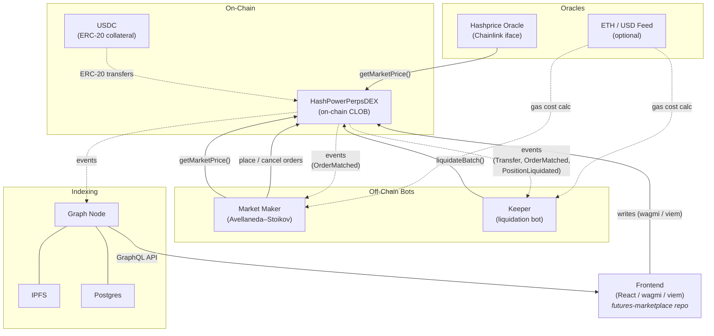

# Titan Perps

On-chain perpetual futures trading platform with an order book model, built on Arbitrum.

## Architecture



### Components

**Smart Contracts** (`contracts/`) — The core perpetual trading engine. A single upgradeable `HashPowerPerpsDEX` contract implements the full on-chain central limit order book, collateral custody, margin accounting, position management, and liquidation logic. See [`contracts/README.md`](contracts/README.md) for implementation details.

**Hashprice Oracle** — An external Chainlink-compatible price oracle ([`hashprice-oracle`](https://github.com/Lumerin-protocol/hashprice-oracle)) that feeds BTC hashprice data to the contract. The contract reads the oracle through the standard `AggregatorV3Interface`, so any Chainlink-style feed can be swapped in.

**Indexer** (`indexer/`) — A Graph Protocol subgraph that listens to contract events and builds a queryable GraphQL API. It tracks the order book, trade history, user positions, collateral events, and aggregated stats. The frontend and any off-chain services consume data from here instead of reading contract state directly. See [`indexer/README.md`](indexer/README.md) for schema and query examples.

**Keeper** (`keeper/`) — An off-chain liquidation bot that monitors user positions via a built-in mini-indexer (no subgraph dependency). It watches contract events in real-time to track positions and balances locally, pre-computes the liquidation price for each user, and polls the oracle price. When the market price crosses a user's liquidation threshold, the keeper verifies on-chain and executes the `liquidate(user)` call to earn the liquidation fee. Built with Node.js, TypeScript, and viem.

**Market Maker** (`market-maker/`) — Automated two-sided liquidity provider for the on-chain CLOB. Places layered limit orders around the oracle price using an Avellaneda-Stoikov inspired quoting strategy, with dynamic spread adjustment based on inventory skew, volatility, and gas conditions. Includes risk controls (position limits, utilization caps, drawdown halt, daily loss limits, gas budgets) and a health-check HTTP endpoint. See [`market-maker/README.md`](market-maker/README.md) for configuration and strategy details.

**E2E Tests** (`e2e/`) — Full-stack integration tests that exercise the entire system: Hardhat node, contract deployment, subgraph indexing via Graph Node, and the keeper liquidation bot. Runs against a Dockerized infrastructure stack (Hardhat, Graph Node, IPFS, Postgres). See [`e2e/README.md`](e2e/README.md) for setup instructions.

**Frontend** ([`futures-marketplace`](https://github.com/Lumerin-protocol/futures-marketplace)) — React-based trading UI shared between futures and perps. Handles order placement, collateral management, position tracking, and trade history. Communicates with the contract via wagmi/viem for writes and the subgraph for reads.

### Data Flow

1. **Oracle** pushes price updates on-chain. The contract reads the latest price for margin checks, liquidation eligibility, and mark-to-market calculations.
2. **Users** interact with the contract through the frontend — depositing collateral, placing/cancelling orders, and withdrawing funds.
3. **Matching engine** executes on-chain when `createOrder` is called. Matched trades settle immediately: positions are updated and PnL flows through the reserve pool.
4. **Subgraph** indexes all emitted events into structured entities (orders, trades, positions, price levels, etc.) and serves them over GraphQL.
5. **Frontend** queries the subgraph for order book depth, trade history, and portfolio data to render the UI.
6. **Keeper** watches contract events to track positions and balances locally, pre-computes liquidation prices, and executes liquidations when the oracle price crosses a threshold.
7. **Market Maker** reads the oracle price each tick, computes bid/ask levels with inventory-aware spreads, and reconciles desired quotes against resting orders on-chain.

## Repository Structure

```
contracts/          Solidity smart contracts (Hardhat + Foundry)
indexer/            Graph Protocol subgraph
keeper/             Liquidation keeper bot (Node.js + viem)
market-maker/       Automated market maker bot (Node.js + viem)
e2e/                Full-stack integration tests (Docker + Graph Node)
```

## Getting Started

### Prerequisites

- Node.js 20.x (contracts/indexer) or 22.x (keeper/market-maker/e2e)
- [pnpm](https://pnpm.io/)
- [Foundry](https://book.getfoundry.sh/) (for Solidity formatting)
- Docker & Docker Compose (for subgraph development and e2e tests)
- .env file in the root of the project with filled in environment variables

### Contracts

```bash
cd contracts
pnpm install
pnpm test              # Run test suite
pnpm compile           # Generate ABIs via wagmi
pnpm format:sol        # Format Solidity files
pnpm deploy-local      # Deploy to local Hardhat network
```

### Indexer

```bash
cd indexer
pnpm install
pnpm indexer            # Start graph-node via Docker
pnpm setup-local       # Codegen, build, create & deploy subgraph
```

### Keeper

```bash
cd keeper
pnpm install
pnpm start             # Run keeper (reads ../.env)
pnpm start:dry         # Dry-run mode (simulate without executing)
pnpm typecheck         # Type-check TypeScript
```

Add `KEEPER_PRIVATE_KEY` to the root `.env` file. See [`keeper/.env.example`](keeper/.env.example) for all keeper-specific configuration.

### Market Maker

```bash
cd market-maker
pnpm install
pnpm start             # Run market maker (reads ../.env)
pnpm dev               # Development with pretty-printed logs
pnpm dev:dry           # Dry run (logs what would happen, no txs)
pnpm test              # Run tests (unit + e2e against local Hardhat)
```

Add `MAKER_PRIVATE_KEY` to the root `.env` file. See [`market-maker/README.md`](market-maker/README.md) for the full configuration reference.

### E2E Tests

```bash
cd e2e
pnpm install
pnpm up                # Start Docker stack (Hardhat, Graph Node, IPFS, Postgres)
pnpm test              # Run full-stack integration tests
pnpm down              # Stop and remove volumes
```

See [`e2e/README.md`](e2e/README.md) for architecture and troubleshooting.

See [`contracts/README.md`](contracts/README.md) and [`indexer/README.md`](indexer/README.md) for more details.

## Tech Stack

| Layer        | Technology                                      |
| ------------ | ----------------------------------------------- |
| Contracts    | Solidity 0.8.28, OpenZeppelin, Hardhat, Foundry |
| Oracle       | Hashprice Oracle (Chainlink AggregatorV3 iface) |
| Indexer      | The Graph, AssemblyScript                       |
| Keeper       | Node.js 22, TypeScript, viem                    |
| Market Maker | Node.js 22, TypeScript, viem, pino              |
| E2E Tests    | Node.js 22, Docker Compose, Graph Node          |
| Frontend     | React, wagmi, viem (planned)                    |
| Tooling      | pnpm, TypeScript, Biome                         |
| Network      | Arbitrum                                        |

## License

Contracts are licensed under MIT. Indexer is UNLICENSED.
