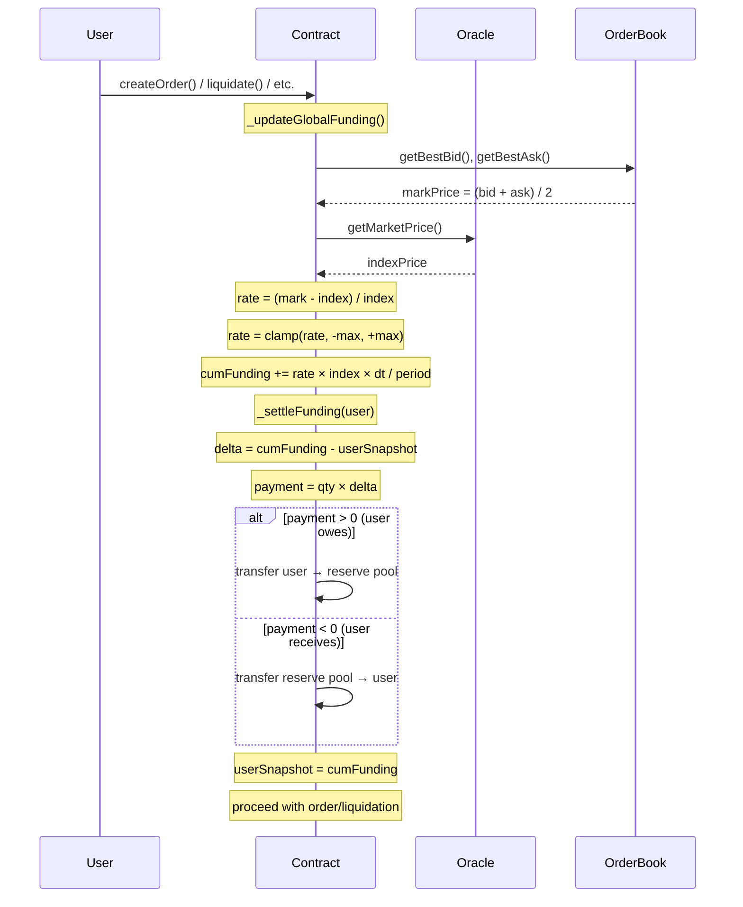
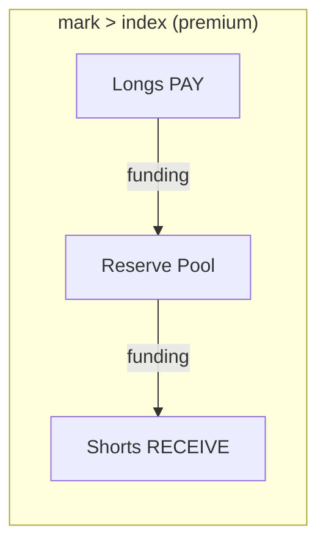
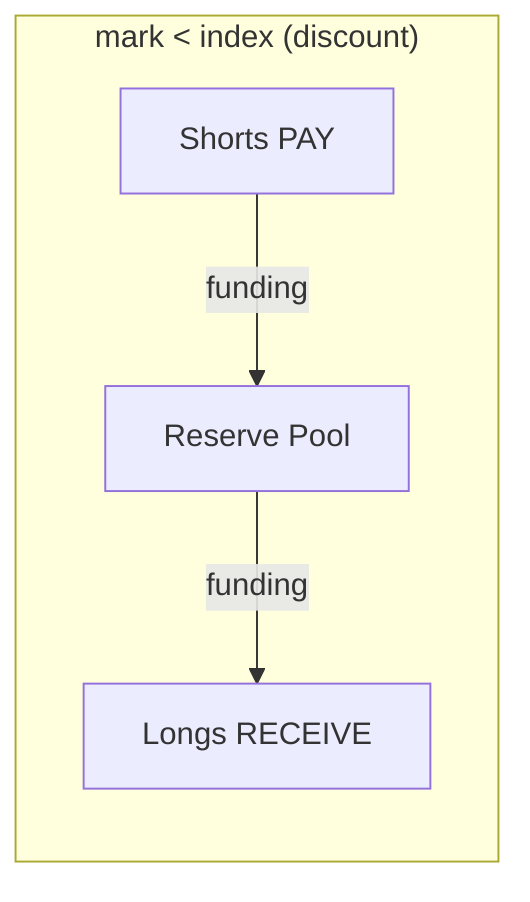

# Cumulative Funding Mechanism

## Overview

Funding is a periodic payment between long and short position holders that anchors the perpetual contract's trading price to the underlying oracle (index) price. When the order-book mid-price trades **above** the oracle, longs pay shorts — incentivizing sellers and pushing the price down. When it trades **below**, shorts pay longs.

This contract uses a **cumulative funding** model: instead of settling all users at fixed intervals (like CEXs every 8 hours), it maintains a single global accumulator (`cumulativeFundingPerUnit`) that grows over time. Each user stores a snapshot of this accumulator. The difference between the current accumulator and the snapshot determines what they owe or are owed.

## Key State Variables

| Variable | Type | Description |
|---|---|---|
| `cumulativeFundingPerUnit` | `int256` | Global accumulator — total funding accrued per 1 unit of position since inception |
| `lastFundingUpdateTime` | `uint256` | Timestamp of the last accumulator update |
| `fundingRateMaxBps` | `uint256` | Max absolute funding rate per `fundingPeriod` in basis points (e.g. 100 = 1%) |
| `fundingPeriod` | `uint256` | Time window for the max rate in seconds (e.g. 86400 = 24h) |
| `userFundingSnapshot[user]` | `int256` | Per-user snapshot of `cumulativeFundingPerUnit` at last settlement |

## How It Works

### Step 1: Compute the Funding Rate

```
markPrice  = (bestBid + bestAsk) / 2    ← order-book mid-price
indexPrice = oracle price

fundingRate = (markPrice - indexPrice) / indexPrice
fundingRate = clamp(fundingRate, -maxRate, +maxRate)
```

The rate is clamped to `fundingRateMaxBps / 10000` to prevent excessive payments from thin order books or manipulation.

### Step 2: Accumulate into Global State

```
timeElapsed = now - lastFundingUpdateTime

deltaCumFunding = fundingRate × indexPrice × timeElapsed / fundingPeriod

cumulativeFundingPerUnit += deltaCumFunding
lastFundingUpdateTime = now
```

This runs inside `_updateGlobalFunding()`, called at the top of every state-changing function (`createOrder`, `cancelOrder`, `addCollateral`, `removeCollateral`, `liquidate`).

### Step 3: Settle Per-User Funding

```
delta = cumulativeFundingPerUnit - userFundingSnapshot[user]

pendingFunding = netQuantity × delta / (10^QUANTITY_DECIMALS × 10^FUNDING_DECIMALS)
```

- **`pendingFunding > 0`** → user pays (transferred to reserve pool)
- **`pendingFunding < 0`** → user receives (transferred from reserve pool)

After settlement, the user's snapshot is updated to the current `cumulativeFundingPerUnit`.

## Flow Diagram



## Numeric Example

**Setup:**
- `fundingRateMaxBps = 100` (1% max per period)
- `fundingPeriod = 86400` (24 hours)
- Collateral token has 6 decimals (USDC)

**Scenario:** Alice is long 1.0 unit (`netQuantity = 1_000_000`). The order book mid-price is $2050, oracle is $2000.

```
fundingRate = (2050 - 2000) / 2000 = 0.025 (2.5%)
                → clamped to 0.01 (1% max)

After 1 hour (3600s):
  deltaCumFunding = 0.01 × 2000 × 10^6 × 3600 / 86400
                  = 0.01 × 2_000_000_000 × 3600 / 86400
                  = 833_333  (in tokenDecimals × fundingPrecision units)

Alice's payment = 1_000_000 × 833_333 / (10^6 × 10^18)
                ≈ 0.000833 USDC per hour
                ≈ 0.02 USDC per day
```

(At 1% max rate, Alice pays ~1% × $2000 = $20 per day per unit at full utilization of the cap. The example above shows 1 hour of accrual.)

## Who Pays Whom





## When Does Funding Update?

The global accumulator is refreshed on every user-facing state change:

| Function | Updates Funding | Why |
|---|---|---|
| `createOrder()` | Yes | Orders change the book → mark price changes |
| `cancelOrder()` | Yes | Removing orders changes the book |
| `addCollateral()` | Yes | Opportunistic freshness |
| `removeCollateral()` | Yes | Ensures margin check uses latest funding |
| `liquidate()` | Yes | Must settle funding before closing position |
| `updateFunding()` | Yes | Public fallback for external callers |

Per-user settlement (`_settleFunding`) happens inside `_updateUserPosition`, which runs whenever a position is created or modified via order matching, or during liquidation.

## Why Cumulative Instead of Discrete?

| Property | Discrete (CEX) | Cumulative (this contract) |
|---|---|---|
| Settlement | Every 8h for all users | Lazy, per-user on interaction |
| Gas cost | O(n) per settlement round | O(1) per user interaction |
| Funding sniping | Possible (open after, close before) | Not possible — proportional to hold time |
| Accuracy vs. oracle drift | Snapshot once per 8h | Snapshot on every contract interaction |
| Keeper dependency | Required for batch settlement | Not required (nice-to-have for freshness) |

## Edge Cases

- **Empty order book:** If either side has no orders, `markPrice` can't be computed → no funding accrues during that period.
- **User can't pay:** If a user's balance is insufficient, they pay what they have and `BadDebt` is emitted. They'll likely be liquidated soon.
- **Reserve pool empty:** If the reserve can't pay a user who is owed funding, they receive whatever is available.
- **Same-block interactions:** Multiple txs in the same block produce `timeElapsed = 0` → no additional funding accrues → `_updateGlobalFunding` is effectively a no-op (just a storage read).
