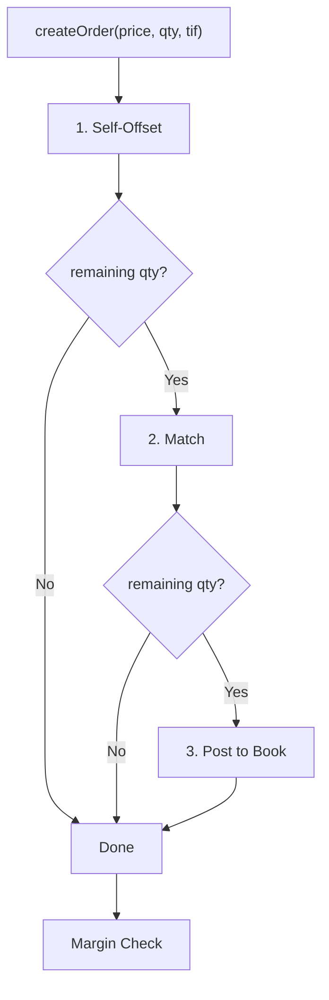
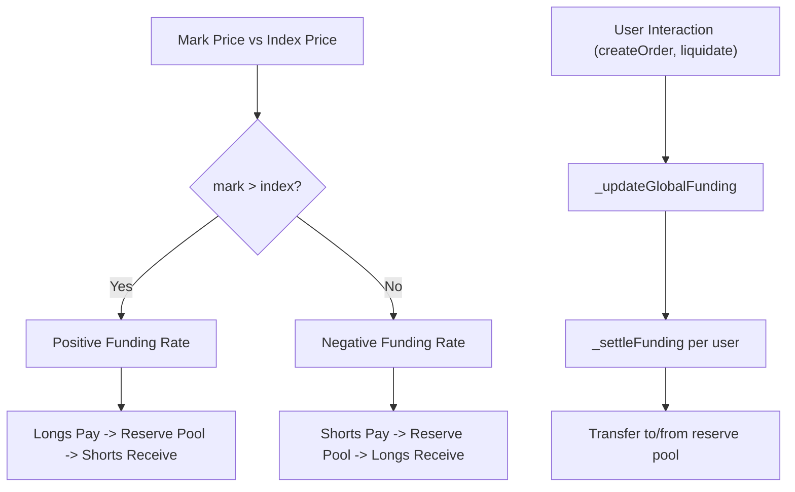

## How It Works

### On-Chain Order Book

The core of the system is a fully on-chain central limit order book (CLOB). Users place limit orders at a specific price and signed quantity (positive = buy/long, negative = sell/short). Orders are stored in FIFO queues per price level, with sorted linked lists tracking active bid prices (highest first) and ask prices (lowest first).

When a new order arrives, the matching engine runs in three stages:

1. **Self-offset** — cancels the user's own opposite orders that would cross the incoming limit price, avoiding self-trading.
2. **Match** — walks the opposite side of the book and fills against resting orders at the maker's price (price improvement for the taker). Partial fills leave the remainder on the book.
3. **Post** — any unmatched quantity is inserted into the book at the limit price.

An order fee is charged per submission, and margin is checked after every order.

### Order Matching

Every order goes through `createOrder(price, quantity, timeInForce)` where `price` is a limit price and `quantity` is signed (positive = buy/long, negative = sell/short). The function processes the order in three sequential stages, each consuming as much of the remaining quantity as possible before passing the rest to the next stage.



#### Stage 1 — Self-Offset

Before matching against other participants, the engine cancels the caller's own resting orders on the opposite side that would cross the incoming limit price. This prevents self-trading.

`_offsetUserOppositeOrders` walks the opposite price list (asks for a buy, bids for a sell) from best price outward. At each price level that crosses the limit, `_offsetOrdersAtPrice` iterates the user's own orders at that price in reverse and reduces both the resting order and the incoming quantity by the overlap amount. Fully consumed resting orders are removed from the book.

#### Stage 2 — Match

`_matchWithOppositeOrders` walks the opposite side of the book from the best price outward, stopping when the price no longer crosses the limit or the incoming quantity is exhausted.

At each price level, `_matchOrdersAtPrice` iterates the FIFO queue front-to-back. For each resting order (skipping the taker's own orders), `_executeMatch` runs:

1. **Match amount** — `min(abs(resting order qty), abs(incoming qty))`
2. **Execution price** — always the maker's (resting) price, giving the taker price improvement when the book price is better than the limit
3. **Position updates** — `_createPosition` determines buyer/seller from the quantity sign, then calls `_updateUserPosition` for each side (settling funding, updating net position, calculating PnL)
4. **Fees** — taker and maker fees are charged on the notional value of the match
5. **Book cleanup** — the resting order's quantity is reduced; if fully filled, the order is removed and the price level is cleaned up if empty

#### Stage 3 — Post

Any remaining quantity after matching is inserted into the book as a new resting order:

1. An `Order` struct is created with a unique ID (hash of participant, price, quantity, timestamp, nonce)
2. The order is pushed to the back of the FIFO queue at its price level (`priceOrdersLongQueue` for bids, `priceOrdersShortQueue` for asks)
3. The price level is inserted into the sorted linked list (`activeBidPrices` descending, `activeAskPrices` ascending) if not already present
4. The order is indexed by participant and by participant+price for efficient lookup during self-offset and cancellation

After all three stages, `_ensureSufficientMargin` verifies the caller still meets the initial margin requirement.

#### Data Structures

| Structure                                                      | Purpose                                                                                                                                         |
| -------------------------------------------------------------- | ----------------------------------------------------------------------------------------------------------------------------------------------- |
| `activeBidPrices` / `activeAskPrices`                          | Sorted linked lists of active price levels (bids descending, asks ascending). Enable walking the book from best price outward in O(1) per step. |
| `priceOrdersLongQueue[price]` / `priceOrdersShortQueue[price]` | FIFO linked-list queues of order IDs at each price level. Ensure time priority within a price.                                                  |
| `participantOrderIdsIndex[user]`                               | Set of all order IDs belonging to a user. Used for cancellation and margin calculations. Capped at `MAX_ORDERS_PER_PARTICIPANT` (100).          |
| `participantPriceOrderIdsIndex[user][price]`                   | Set of a user's order IDs at a specific price. Enables efficient self-offset lookup.                                                            |
| `userTotalOrderValue[user]`                                    | Cached sum of notional value across all of a user's resting orders. Updated incrementally on create/fill/cancel to avoid re-scanning.           |

### Collateral and Margin

Users deposit an ERC-20 collateral token (e.g. USDC) into the contract, which mints an internal ERC-20 receipt token 1:1. This balance serves as the user's available margin.

Margin is **not** computed by this contract. Both tiers come from the `PortfolioMarginEngine`, which nets exposure across every product settling into the same `CollateralVault` (perps, futures, options):

- **Initial margin** — `portfolioMargin.computePortfolioIM(user)`. Required to place orders (non-reduce-only) and to withdraw.
- **Maintenance margin** — `portfolioMargin.computePortfolioMM(user)`. Below this the account is liquidatable; the engine's `isLiquidatable(user)` view and every `liquidate*` entry point compare the vault balance against it.

#### What the DEX contributes

The engine reads one batched view per market, `getRiskView(user)`:

```
netPositionDelta  = netQuantity * 10^collateralDecimals / 10^QUANTITY_DECIMALS
unrealizedPnl     = mark PnL only
pendingFunding    = getPendingFunding(user)
buyOrderDelta     = Σ|q| over resting bids, scaled like netPositionDelta
sellOrderDelta    = Σ|q| over resting asks
buyOrderFillLoss  = max(0, Σ q·limit − mark·Σq) over bids
sellOrderFillLoss = max(0, mark·Σq − Σ q·limit) over asks
```

`unrealizedPnl` here is **not** `getUnrealizedPnl(user)`. The engine adds an unrealized loss and funding owed as independent terms, so netting funding into the PnL would charge the same debt twice; `getUnrealizedPnl` keeps netting it because that is the number a trader wants to read.

The DEX reports **no margin figure at all** any more. It reports raw risk — per-side order delta and per-side instant fill loss — and the engine turns that into a requirement by stressing the resting book as post-fill delta:

```
portfolioIM ≥ max( stress(netDelta + Σ buyOrderDelta),
                   stress(netDelta − Σ sellOrderDelta) )
              + Σ buyOrderFillLoss + Σ sellOrderFillLoss
```

The two legs bound the requirement after *any* subset of the account's orders fills: a subset leaves net delta somewhere in `[netDelta − sellOrderDelta, netDelta + buyOrderDelta]`, stress is convex in delta, so the maximum over that interval is at an endpoint, and the no-fill case is interior. That guarantee is the reason the venue cannot compute this itself — there is no margin check on a maker at fill time, so the reservation held against a resting order is the only thing standing between a fill and an under-collateralized account, and only the engine can see the whole portfolio's net delta to know whether an order is risk-increasing.

Two consequences worth naming. Order margin is no longer a per-venue scalar — ask the engine, via `orderMarginOf(user)`, and never sum per-venue figures. And it is no longer constant in price: both the stress term and the fill-loss term move with the mark, so anything modelling it off-chain has to re-evaluate rather than snapshot.

`getOrderAggregate(user)` exposes the cached per-side quantities and limit-price
totals. The fill loss in `getRiskView` is clamped at the current mark, so a
predictor evaluating other prices uses the aggregate's raw values instead.

The engine then applies its own spot/vol stress scenarios to the netted delta and adds the order margin, unrealized loss and funding owed. Because delta is netted across products, a perps position hedged with futures or options requires less collateral than either leg would in isolation — the portfolio requirement is not the sum of the parts.

Users below initial margin cannot increase exposure or withdraw, but are not liquidated until they fall below maintenance margin. Reduce-only orders (opposite side of position, not exceeding position size) bypass the IM check entirely, ensuring users can always exit a losing position.

### Positions and PnL

Each user has a single **net position** (long or short) with a weighted-average entry price. When a trade occurs:

- **Same direction** — the position grows and the entry price is recalculated as a weighted average.
- **Opposite direction (partial offset)** — the overlapping portion is closed at the trade price, realized PnL is settled immediately, and the remainder stays open.
- **Opposite direction (full offset or flip)** — the entire original position is closed and settled. Any excess quantity opens a new position in the opposite direction at the trade price.

Realized PnL is settled through a **reserve pool**: profits are paid from the pool to the user, and losses are transferred from the user back into the pool.

### Liquidation

Anyone can call `liquidate(user)` if the user's collateral falls below their maintenance margin. The liquidation:

1. Calculates PnL at the current oracle price and settles it against the reserve pool.
2. Pays a fixed liquidation fee to the caller from the user's remaining balance.
3. Deletes the position entirely.

### Price Oracle

The contract uses a Chainlink `AggregatorV3Interface` oracle for the mark price. Prices are scaled to match collateral token decimals and rounded to the configured `minimumPriceIncrement`. A staleness check (1 hour max) rejects outdated oracle data.

#### Contract size

The hashprice oracle quotes the price of **1 PH/s sustained over one day**, matching the fixed compile-time constant `CONTRACT_SIZE_HPS_DAY = 1e15` (hashes/s·day). `getMarketPrice()` therefore applies only decimal scaling and tick rounding — no unit rebase. The contract size is a constant baked into the implementation (no runtime setter).

### Upgradeability

The contract uses the UUPS proxy pattern (OpenZeppelin) so the implementation can be upgraded by the owner without redeploying state.

#### v2.13 order aggregate migration

v2.13 replaces four independent order-cache mappings with one appended
`OrderAggregate` per user. The old mapping slots remain in storage but are dead:
all reads and writes use the aggregate's buy/sell quantities and values.

`upgrade:perps` only upgrades the implementation. After upgrading from a version
before 2.13, immediately run `pnpm rebuild:order-aggregate-cache`. This is a
deliberately non-atomic migration: existing orders have zero aggregate cache
until the rebuild transactions complete.

The rebuild script discovers order owners from `OrderCreated` RPC logs over the
preceding 180 days and confirms candidates against `getUserOrders`. Set
`EVENT_LOOKBACK_DAYS` to change the search period. It writes in
`ORDER_CACHE_WRITE_BATCH_SIZE` batches (default 25) and verifies all four fields
against a canonical order scan.

#### Explicit reset and migration participants

The contract does not enumerate position holders on chain. The legacy
`usersWithPositions` storage slot remains dead and untouched solely for proxy
layout compatibility.

Testnet resets require an explicit comma-separated participant list:

```sh
PERPS_ADDRESS=0x... RESET_PARTICIPANTS=0x...,0x... pnpm reset:perps
```

The script deduplicates addresses and calls `resetState(address[])` in
`RESET_BATCH_SIZE` batches (default 25). Only supplied accounts have their
orders, position, and funding snapshot cleared; collateral, global funding, and
the monotonic order nonce are preserved. Operators must build a complete list
from authoritative configuration or indexed event history. Any future net-entry
position migration must likewise accept explicit participant arrays and must not
read the dead enumeration slot.

### Funding Fees

Funding fees keep the perpetual price anchored to the spot price by charging/rewarding position holders based on the deviation between the **mark price** (order book mid-price) and the **index price** (oracle). When mark > index, longs pay shorts (and vice versa). Funding accrues continuously (per-second) and settles lazily through the reserve pool when users interact.



#### State Variables

```solidity
uint256 private constant FUNDING_PRECISION = 1e18;

int256 public cumulativeFundingPerUnit;   // Global cumulative funding (tokenDecimals * FUNDING_PRECISION)
uint256 public lastFundingUpdateTime;     // Last timestamp funding was updated
uint256 public fundingRateMaxBps;         // Max absolute funding rate per fundingPeriod in bps (e.g., 100 = 1%)
uint256 public fundingPeriod;             // Period for max rate (e.g., 86400 = 24 hours)
mapping(address => int256) private userFundingSnapshot; // Per-user snapshot of cumulativeFundingPerUnit
```

#### Core Funding Functions

- **`_getCurrentCumulativeFunding()`** (private view) — Computes the theoretical cumulative funding as of `block.timestamp` without writing state. Used by both the state-mutating update and view functions.
  - Gets mark price as `(bestBid + bestAsk) / 2`; if either side is empty, returns current stored value (no funding accrues without a two-sided book)
  - Calculates `fundingRate = (markPrice - indexPrice) * PRECISION / indexPrice`, clamped to `[-maxRate, maxRate]`
  - Computes `deltaCumFunding = fundingRate * indexPrice * timeElapsed / fundingPeriod`
  - Returns `cumulativeFundingPerUnit + deltaCumFunding`

- **`_updateGlobalFunding()`** (private) — Called before any position-affecting operation. Writes the new cumulative funding and `lastFundingUpdateTime`.

- **`_settleFunding(address user)`** (private) — Settles pending funding for a specific user:
  - Computes `pendingFunding = netQuantity * (currentCumFunding - userSnapshot) / (QUANTITY_DECIMALS_SCALE * FUNDING_PRECISION)`
  - Positive result = user owes (long paying in positive-rate environment) -> transfer from user to reserve pool
  - Negative result = user receives -> transfer from reserve pool to user (capped by reserve pool balance)
  - Updates `userFundingSnapshot[user]` and emits `FundingSettled`

- **`updateFunding()`** (external) — Public standalone function so keepers can trigger funding updates even during idle periods.

- **`getPendingFunding(address user)`** (public view) — Returns the pending funding for a user using `_getCurrentCumulativeFunding()`.

#### Integration with Existing Functions

- **`createOrder()`** — Calls `_updateGlobalFunding()` at the top. Per-user settlement happens inside `_updateUserPosition` during matching.
- **`_updateUserPosition()`** — Calls `_settleFunding(user)` at the very start, before any position logic, ensuring funding is settled at the old position size.
- **`liquidate()`** — Calls `_updateGlobalFunding()` + `_settleFunding(user)` before liquidation logic. Pending funding debt affects liquidatability.
- **`getRiskView()`** — Reports pending funding to the `PortfolioMarginEngine`, which adds it to the margin requirement when positive (user owes).
- **`getUnrealizedPnl()`** — Subtracts pending funding from unrealized PnL so users see the full picture.

#### Position Lifecycle and Funding Snapshots

- When a position is **opened** (new from zero), set `userFundingSnapshot[user] = cumulativeFundingPerUnit`
- When a position is **closed** (deleted), settle funding first, then clean up snapshot
- When a position is **modified** (increased/decreased), settle funding at old quantity, then update snapshot

This is handled by calling `_settleFunding` at the start of `_updateUserPosition`, which covers all cases.

#### Key Math

```
fundingRate = clamp((markPrice - indexPrice) / indexPrice, -maxRate, maxRate)
cumulativeFundingPerUnit += fundingRate * indexPrice * timeElapsed / fundingPeriod
pendingFunding = netQuantity * deltaCumulativeFunding / QUANTITY_DECIMALS_SCALE / FUNDING_PRECISION
```

- Positive `pendingFunding` = user owes (long with positive rate, or short with negative rate)
- Negative `pendingFunding` = user receives
- All payments route through the reserve pool (`balanceOf(address(this))`)
