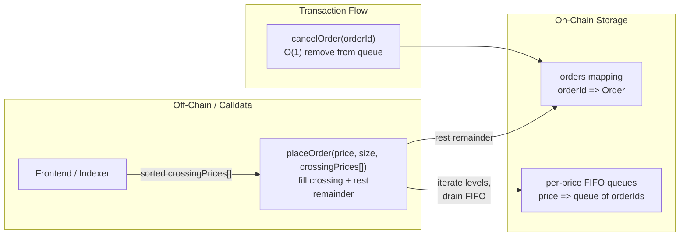
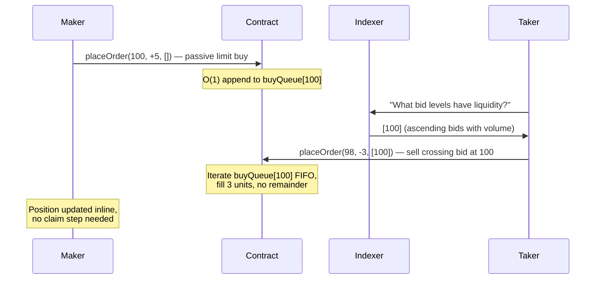

# Option B: Hashmap + Calldata-Sorted Prices (Crankless CLOB)

## Summary

Eliminate on-chain price-level sorting. Store orders in per-price FIFO queues with O(1) placement and cancellation. Price levels are tracked in flat hashmaps — no sorted linked list. When an order crosses the book, the caller provides sorted crossing price levels as calldata. The contract verifies ordering and drains each level's FIFO queue, enforcing time priority on-chain.

A "market order" is just a limit order at an aggressive price with crossing levels. A "passive limit" is one with an empty crossing array. There is one unified function.

## Architecture



## How It Works

### Data Structures

Remove the sorted `StructuredLinkedList` for price levels (`activeBidPrices` / `activeAskPrices`). Keep `StructuredLinkedList` for per-price FIFO queues — they give O(1) push-back, O(1) pop-front, and O(1) removal by node ID (for cancellations):

```solidity
struct Order {
    address owner;
    uint256 price;
    int256 size;        // positive = long, negative = short
    uint256 createdAt;
}

mapping(bytes32 => Order) private orders;                                          // orderId => Order
mapping(uint256 => StructuredLinkedList.List) private priceOrdersLongQueue;        // price => FIFO queue of buy orders
mapping(uint256 => StructuredLinkedList.List) private priceOrdersShortQueue;       // price => FIFO queue of sell orders
mapping(address => EnumerableSet.Bytes32Set) private participantOrderIdsIndex;     // user => their order IDs

// REMOVED: no more sorted price-level lists
// StructuredLinkedList.List private activeBidPrices;   ← deleted
// StructuredLinkedList.List private activeAskPrices;   ← deleted

uint256 private orderNonce;
```

### Unified Order Placement

Every order goes through one function. The caller provides sorted crossing price levels. The contract fills what it can, then rests the remainder:

```solidity
function placeOrder(
    uint256 price,
    int256 size,
    uint256[] calldata crossingPrices  // sorted opposite-side levels with liquidity
) external {
    _updateGlobalFunding();
    _validatePrice(price);
    _validateQuantity(size);

    uint256 remaining = abs(size);
    bool isBuy = size > 0;

    // ── 1. Fill crossing price levels ──────────────────────────
    for (uint256 i = 0; i < crossingPrices.length && remaining > 0; i++) {
        uint256 levelPrice = crossingPrices[i];

        // Validate: price actually crosses
        if (isBuy) require(levelPrice <= price, "ask doesn't cross");
        else       require(levelPrice >= price, "bid doesn't cross");

        // Validate: caller provided prices in best-first order
        if (i > 0) {
            if (isBuy) require(levelPrice >= crossingPrices[i - 1], "asks not ascending");
            else       require(levelPrice <= crossingPrices[i - 1], "bids not descending");
        }

        // Drain FIFO queue at this price level
        remaining = _fillAtPrice(levelPrice, remaining, isBuy);
    }

    // ── 2. Rest the remainder as a passive limit order ─────────
    if (remaining > 0) {
        int256 restSize = isBuy ? int256(remaining) : -int256(remaining);
        _placePassiveOrder(msg.sender, price, restSize);
    }

    _ensureSufficientMargin(msg.sender);
}
```

### Filling a Price Level (FIFO)

Same FIFO drain as the current `_matchOrdersAtPrice`, using `StructuredLinkedList` for the per-price queue:

```solidity
function _fillAtPrice(
    uint256 levelPrice,
    uint256 remaining,
    bool isBuy
) private returns (uint256) {
    StructuredLinkedList.List storage orderQueue = isBuy
        ? priceOrdersShortQueue[levelPrice]
        : priceOrdersLongQueue[levelPrice];

    while (remaining > 0 && orderQueue.sizeOf() > 0) {
        (, uint256 orderIdUint) = orderQueue.getNextNode(0);  // peek head
        bytes32 orderId = bytes32(orderIdUint);
        Order storage contra = orders[orderId];

        uint256 fillAmt = min(remaining, abs(contra.size));

        // Execute match: update positions, charge fees
        _executeMatch(msg.sender, orderId, contra, fillAmt, isBuy);

        remaining -= fillAmt;
        contra.size = _reduceQuantity(contra.size, fillAmt);

        if (contra.size == 0) {
            // Order fully filled — remove node from linked list and index
            orderQueue.remove(orderIdUint);
            participantOrderIdsIndex[contra.owner].remove(orderId);
            delete orders[orderId];
            emit OrderFilled(orderId, contra.owner);
        }
    }

    return remaining;
}
```

### Passive Order Placement (O(1))

Appending to the tail of a `StructuredLinkedList` is O(1) — no sorting, no price-level insertion:

```solidity
function _placePassiveOrder(address owner, uint256 price, int256 size) private {
    bytes32 orderId = _generateOrderId(owner, price, size);
    orders[orderId] = Order({
        owner: owner,
        price: price,
        size: size,
        createdAt: block.timestamp
    });

    // Append to FIFO queue tail — O(1) via StructuredLinkedList.pushBack
    bool isBuy = size > 0;
    StructuredLinkedList.List storage orderQueue = isBuy
        ? priceOrdersLongQueue[price]
        : priceOrdersShortQueue[price];
    orderQueue.pushBack(uint256(orderId));

    participantOrderIdsIndex[owner].add(orderId);
    emit OrderCreated(orderId, owner, price, size);

    // NOTE: no _addPriceLevel() call — no sorted price list to maintain
}
```

### Cancellation (O(1))

With `StructuredLinkedList`, cancellation properly removes the node from the queue — no lazy deletion, no dead nodes:

```solidity
function cancelOrder(bytes32 orderId) external {
    Order storage order = orders[orderId];
    require(order.owner == msg.sender, "not owner");

    bool isBuy = order.size > 0;
    StructuredLinkedList.List storage orderQueue = isBuy
        ? priceOrdersLongQueue[order.price]
        : priceOrdersShortQueue[order.price];

    orderQueue.remove(uint256(orderId));
    participantOrderIdsIndex[msg.sender].remove(orderId);
    delete orders[orderId];

    emit OrderCancelled(orderId, msg.sender);
}
```

## Flow Diagram



## What Stays, What Changes

### Removed

| Current | Why |
|---|---|
| `StructuredLinkedList` for `activeBidPrices` / `activeAskPrices` | No on-chain price sorting — frontend provides sorted levels |
| `_addPriceLevel` / `_removePriceLevelIfEmpty` | No sorted price list to maintain |
| `_matchWithOppositeOrders` (iterates sorted prices on-chain) | Replaced by calldata iteration in `placeOrder` |

### Replaced

| Current | New |
|---|---|
| `createOrder` (atomic match + rest) | `placeOrder(price, size, crossingPrices[])` — same logic, but price iteration from calldata |
| `_matchWithOppositeOrders` (walks sorted price list) | Calldata loop in `placeOrder` — caller provides sorted levels |
| `_matchOrdersAtPrice` (gets queue, iterates) | `_fillAtPrice` — same FIFO drain, called from calldata loop |

### Preserved Unchanged

- `StructuredLinkedList` per-price FIFO queues (`priceOrdersLongQueue`, `priceOrdersShortQueue`)
- `participantOrderIdsIndex` (user order tracking)
- Position management (`_updateUserPosition`, `_createPosition`)
- Collateral system (`addCollateral`, `removeCollateral`)
- Funding mechanism (all funding functions)
- Liquidation logic
- Margin calculations
- Oracle integration
- Fee charging (`_chargeMatchFee`)

## Concurrency and Stale Calldata

The biggest difference from the current contract: the taker reads book state from an indexer and submits price levels as calldata. Between read and transaction landing, the state can change.

### What happens when calldata is stale

| Scenario | Behavior |
|---|---|
| Price level fully drained by another taker | Inner FIFO loop exits immediately (head is null), moves to next level |
| Some orders at a level were canceled | Already removed from linked list — loop never sees them |
| New orders added at a level | They're at the tail — taker fills older orders first (correct FIFO) |
| Price level doesn't exist | Queue `sizeOf() == 0`, loop body never executes |
| All crossing levels drained | Remaining size rests as a passive limit order at the caller's price |

**No reverts on stale data.** The worst case is a partial fill with the remainder resting — which is reasonable behavior for a limit order.

### Mitigations

1. **Over-provision levels** — frontend includes more price levels than strictly needed
2. **Slippage parameter** — add an optional `minFillAmount` that reverts the whole tx if the aggressive portion doesn't fill enough
3. **Short block times** (L2) — staleness window is sub-second on most L2s
4. **Passive fallback is fine** — remainder becoming a resting order is expected limit order behavior

## Gas Comparison

| Operation | Current (sorted linked list) | Option B (hashmap + calldata) |
|---|---|---|
| Passive limit order | O(P) linked list insert ~100-300K | O(1) queue append ~50-80K |
| Cancel order | O(1) ~50K | O(1) ~50K (remove from linked list) |
| Crossing order (per level) | ~5-10K/order, walks sorted list | ~5-10K/order, walks calldata |
| Crossing order (total) | Unbounded (iterates all price levels) | Bounded by calldata length |

The **passive limit order** is where the big savings are. The current O(P) insertion into the sorted price-level list (where P = number of existing price levels on that side) becomes O(1). The per-price queue append (`pushBack`) is the same cost either way — the savings come entirely from removing `_addPriceLevel`.

Cancellation cost is unchanged — `StructuredLinkedList.remove()` is O(1) in both designs.

Crossing cost per order is similar — the FIFO drain loop is the same work either way. The difference is where the price-level iteration comes from (on-chain sorted list vs calldata).

## Off-Chain Infrastructure Required

1. **Indexer:** Track all active orders, compute which price levels have liquidity and their total volume. This is a simple event-driven indexer — listen to `OrderCreated`, `OrderFilled`, `OrderCancelled` events.

2. **Frontend:** Before submitting a crossing order, query the indexer for opposite-side price levels with volume. Sort best-first (ascending asks for buys, descending bids for sells). Pass as `crossingPrices[]` calldata.

**No keeper needed.** Everything settles inline in the taker's transaction.

### Degraded mode (indexer down)

- Passive limit orders still work (empty `crossingPrices[]`)
- Crossing orders cannot be submitted (no way to know which levels have liquidity)
- Existing positions, collateral, funding, liquidations all unaffected

## Migration Path

1. Deploy new contract with hashmap-based order book
2. Migrate positions, collateral balances, and funding state via UUPS upgrade
3. All existing resting orders must be canceled and re-placed (different storage layout)
4. Deploy indexer before launch — it only needs to track events, no complex state

## Limitations

- **Off-chain dependency for crossing orders:** Frontend must provide price levels. Passive limits always work.
- **Crossed book from stale calldata:** If new opposite-side orders arrive between the indexer read and transaction landing, the caller's `crossingPrices` won't include them. The remainder rests as a passive order, creating a crossed book (e.g., resting buy at $105 and resting sell at $103 that should have matched). In the current contract this is impossible — `_matchWithOppositeOrders` walks the sorted price list and always finds crossing orders. Without that list, the contract is blind to it. The book stays crossed until the next order or a keeper resolves it. Mitigations:
  - **Keeper bot:** monitors for crossed books and submits a matching transaction to resolve them. Simple — just `placeOrder` with zero size or a dedicated `resolveBook(crossingPrices[])` function.
  - **Track best bid/ask as state variables:** update on every placement, fill, and cancel. After resting a passive order, check if it crosses the tracked best on the opposite side. Adds gas to every operation but catches the obvious cases. Caveat: keeping best bid/ask accurate across cancellations is tricky — when someone cancels the order at the best price, you'd need to know the next-best price, which requires a sorted list. So this only works as a lower bound, not a guarantee.
  - **Accept short-lived crosses on L2:** with sub-second block times, the window is tiny. The next user or indexer-triggered tx resolves it almost immediately.
- **Self-trade prevention:** Needs explicit handling in `_fillAtPrice` (skip orders where `contra.owner == msg.sender`, or allow and let positions net out like the current contract).
- **No on-chain book query for sorted prices:** `getBestBidPrice()` / `getBestAskPrice()` can't exist without the sorted list. The indexer becomes the source of truth for book state. A workaround: track best bid/ask as state variables updated during fills and placements, but this adds gas.

## When to Choose This

- Gas cost for passive limit orders is the primary bottleneck (current O(P) insertion)
- You're deploying on an L2 with fast blocks (minimizes staleness window)
- You're willing to build a simple event-driven indexer
- You want to keep on-chain FIFO time priority (no trust in off-chain ordering)
- You want the smallest conceptual change from the current architecture — same FIFO queues, just remove the sorted price list
