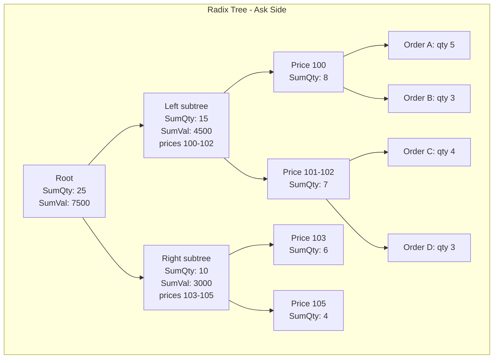
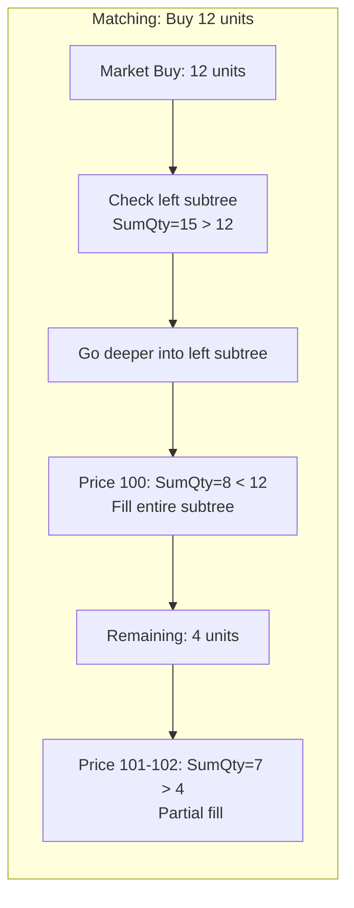

# Option C: Radix Tree (Hanji Style)

## Summary

Replace the linked list + FIFO queue architecture with a radix tree that encodes both price and order sequence into a single 64-bit key. Each internal node aggregates child quantities, enabling O(log N) matching via subtree removal. The matching engine finds the largest subtree fillable by an incoming order and removes it atomically.

## Architecture





## How It Works

### Key Encoding

Each order gets a 64-bit key combining price and sequence:

```
Key = (price_component << ORDER_BITS) | order_sequence

Example with 32 bits for price, 32 bits for order:
  Price 100, Order #5 → key = (100 << 32) | 5 = 0x00000064_00000005
```

This encoding ensures:

- Orders at the same price are grouped together
- Within a price, orders are sorted by insertion order (time priority)
- Tree traversal naturally walks prices in order

### Tree Node Structure

```solidity
struct Node {
    uint256 sumQty;    // aggregate quantity of all descendant orders
    uint256 sumValue;  // aggregate notional value (price * qty) of all descendants
    uint64 left;       // left child key (lower prices/earlier orders)
    uint64 right;      // right child key (higher prices/later orders)
    // Leaf nodes also store:
    address owner;     // order owner (only for leaves)
    int256 quantity;   // signed quantity (only for leaves)
}

mapping(uint64 => Node) private askTree;
mapping(uint64 => Node) private bidTree;
```

### Core Operations

**Insert Order -- O(log N):**

Walk down the tree using the key's bits, create a new leaf, update `sumQty` and `sumValue` on all ancestor nodes on the way back up.

**Cancel Order -- O(log N):**

Find the leaf by key, remove it, update ancestor aggregates.

**Match (Market Buy) -- O(log N):**

```
1. Start at root of ask tree
2. If root.sumQty <= orderSize:
     Fill entire tree, transfer root.sumValue to taker
     Clear tree
3. Else traverse to find largest fillable subtree:
     a. Check left child sumQty
     b. If left.sumQty <= remaining: fill entire left subtree, remaining -= left.sumQty
     c. Recurse into right child (or partially fill)
4. Maximum depth: 64 (key length), so max ~127 steps
```

### Batch Fill via Subtree Removal

The key advantage: when a subtree's `sumQty` fits within the remaining order size, the entire subtree is removed in one operation. All orders in that subtree are considered filled. The `sumValue` from the subtree is transferred to the counterparty.

This means filling 1,000 orders at the same price costs the same as filling 1 order, as long as the subtree can be removed whole.

## What Changes in PerpsSimple.sol

### Complete Replacement of Order Book Layer

| Current                                            | Replaced With                          |
| -------------------------------------------------- | -------------------------------------- |
| `StructuredLinkedList` for price levels            | Radix tree traversal                   |
| `priceOrdersLongQueue` / `priceOrdersShortQueue`   | Radix tree (bid tree / ask tree)       |
| `orders` mapping (by orderId)                      | Tree leaf nodes (by 64-bit key)        |
| `participantOrderIdsIndex`                         | Separate index or embedded in leaves   |
| `participantPriceOrderIdsIndex`                    | Derived from tree key range            |
| `_addPriceLevel` / `_removePriceLevelIfEmpty`      | Implicit in tree insert/remove         |
| `_matchWithOppositeOrders` + `_matchOrdersAtPrice` | Single tree traversal match            |
| `_offsetUserOppositeOrders`                        | Pre-match scan of tree leaves by owner |

### Preserved Unchanged

- Position management
- Collateral system
- Funding mechanism
- Liquidation logic
- Margin calculations
- Oracle integration

## Gas Estimates

| Operation                      | Current                         | Radix Tree                   |
| ------------------------------ | ------------------------------- | ---------------------------- |
| Insert order                   | O(P) ~100-300K                  | O(log N) ~50-80K             |
| Cancel order                   | O(1) ~50K                       | O(log N) ~40-60K             |
| Match (per fill)               | O(1) ~5-10K but unbounded total | O(log N) capped at 127 steps |
| Match 100 orders at same price | ~500K-1M                        | ~20-30K (subtree removal)    |
| Match across 10 price levels   | ~50-100K+                       | O(log N) ~50-80K             |

The key win: batch fills. Filling many orders at the same price is nearly free because the subtree is removed atomically.

## Complexity Analysis

| Operation       | Complexity | Max Steps               |
| --------------- | ---------- | ----------------------- |
| Insert          | O(log N)   | 64                      |
| Remove          | O(log N)   | 64                      |
| Match           | O(log N)   | 127 (traverse + remove) |
| Find best price | O(log N)   | 64                      |

N = total number of orders in the tree. The 64-bit key limits tree height to 64.

## Implementation Considerations

### Price Precision

With 32 bits for price and `minimumPriceIncrement = 0.01 USDC`:

- Max representable price: 2^32 \* 0.01 = 42,949,672.96 USDC
- More than sufficient for most assets

With 40 bits for price and 24 bits for order sequence:

- Max price: 2^40 \* 0.01 = ~10.99 trillion (effectively unlimited)
- Max orders per price: 16.7 million

### Aggregated Entry Price for Batch Fills

When a subtree is removed atomically, the taker gets a weighted average price across all orders in the subtree. The `sumValue / sumQty` gives this directly from the node's aggregates.

### Self-Trade Prevention

During tree traversal, leaf nodes belonging to the taker must be skipped. This is more complex than in a queue because the tree structure doesn't easily support skipping individual leaves during subtree removal. Options:

1. Pre-scan and remove taker's orders before matching (current offset approach)
2. Decompose subtree removal to skip taker's leaves (adds complexity)

## Migration Path

1. Implement `RadixTree` library in Solidity (significant development effort)
2. Replace order book storage with tree-based storage
3. Migrate or cancel all existing orders
4. Extensive testing and auditing (novel data structure in Solidity)

## Limitations

- **Implementation complexity:** Radix trees in Solidity are non-trivial. No standard audited library exists (Hanji's is proprietary).
- **Cancel is O(log N):** Slightly worse than current O(1) cancel, but negligible in practice.
- **Self-trade prevention:** More complex than with separate queues.
- **Audit risk:** Novel Solidity data structure requires thorough auditing.
- **Storage costs:** Each internal node occupies a storage slot; deep trees use more storage than bitmaps.

## When to Choose This

- You need fully on-chain matching with no off-chain dependencies
- The book is expected to have many orders at the same price level (batch fill advantage)
- You're willing to invest in custom data structure development and auditing
- Gas efficiency for matching is more important than implementation simplicity

## Reference

- [Hanji Matching Engine Docs](https://docs.hanji.io/architecture/matching-engine)
- Hanji achieves 6-digit price precision with max 127 matching steps on Etherlink
