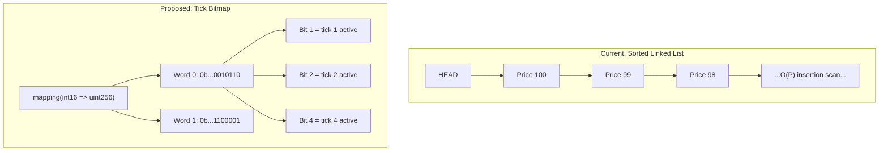

# Option A: Tick Bitmap (Uniswap V3 Style)

## Summary

Replace the sorted linked lists (`activeBidPrices`, `activeAskPrices`) with a bitmap-based price level index. Each bit in a `uint256` word represents whether a price tick has active orders. Finding the next active price becomes a bitwise operation instead of a linked list traversal.

## Architecture



## How It Works

### Price-to-Tick Mapping

Prices in the contract are already multiples of `minimumPriceIncrement`. Map each price to an integer tick:

```
tick = price / minimumPriceIncrement
```

For example, with `minimumPriceIncrement = 0.01 USDC` (10000 in 6-decimal):

- Price 3.00 USDC (3000000) -> tick 300
- Price 2.99 USDC (2990000) -> tick 299

### Bitmap Storage

```solidity
// Replace:
//   StructuredLinkedList.List private activeBidPrices;
//   StructuredLinkedList.List private activeAskPrices;

// With:
mapping(int16 => uint256) private bidTickBitmap;   // 1 bit per tick, 256 ticks per word
mapping(int16 => uint256) private askTickBitmap;

uint256 private bidTickCount;  // total active bid ticks (for sizeOf equivalent)
uint256 private askTickCount;
```

Each `uint256` word holds 256 tick flags. To locate a tick's position:

```solidity
int16 wordPos = int16(tick >> 8);       // tick / 256
uint8 bitPos  = uint8(uint24(tick) % 256);  // tick % 256
```

### Core Operations

**Set a tick (O(1)):**

```solidity
function _setTick(mapping(int16 => uint256) storage bitmap, uint256 tick) private {
    int16 wordPos = int16(int256(tick) >> 8);
    uint8 bitPos = uint8(tick % 256);
    uint256 mask = 1 << bitPos;
    if (bitmap[wordPos] & mask == 0) {
        bitmap[wordPos] |= mask;
        // increment count
    }
}
```

**Clear a tick (O(1)):**

```solidity
function _clearTick(mapping(int16 => uint256) storage bitmap, uint256 tick) private {
    int16 wordPos = int16(int256(tick) >> 8);
    uint8 bitPos = uint8(tick % 256);
    bitmap[wordPos] &= ~(1 << bitPos);
    // decrement count
}
```

**Find next active tick (O(1) within word, O(W) across words):**

```solidity
// For asks (search right/up from current tick):
// Mask off bits at or below current position, find least significant bit
// For bids (search left/down from current tick):
// Mask off bits at or above current position, find most significant bit
```

Reference: [Uniswap V3 TickBitmap.sol](https://github.com/Uniswap/v3-core/blob/main/contracts/libraries/TickBitmap.sol)

## What Changes in HashPowerPerpsDEX.sol

### Data Structures to Replace

| Current                                             | New                                               |
| --------------------------------------------------- | ------------------------------------------------- |
| `StructuredLinkedList.List private activeBidPrices` | `mapping(int16 => uint256) private bidTickBitmap` |
| `StructuredLinkedList.List private activeAskPrices` | `mapping(int16 => uint256) private askTickBitmap` |

### Functions to Modify

| Function                       | Change                                                        |
| ------------------------------ | ------------------------------------------------------------- |
| `_addPriceLevel`               | Replace O(P) linked list scan with O(1) bitmap set            |
| `_removePriceLevelIfEmpty`     | Replace linked list remove with O(1) bitmap clear             |
| `_matchWithOppositeOrders`     | Replace linked list traversal with bitmap next-tick search    |
| `_offsetUserOppositeOrders`    | Same — use bitmap traversal                                   |
| `getBestBidPrice`              | Find MSB of highest occupied word                             |
| `getBestAskPrice`              | Find LSB of lowest occupied word                              |
| `getOrderBookPrices`           | Iterate bitmap words instead of linked list                   |
| `_getCurrentCumulativeFunding` | Uses `getBestBidPrice` / `getBestAskPrice` — no change needed |

### Functions Unchanged

- `_matchOrdersAtPrice` — per-price-level FIFO queue is unchanged
- `_executeMatch`, `_createPosition`, `_updateUserPosition` — no price level logic
- All position, collateral, funding, and liquidation functions
- Order storage (`orders`, `priceOrdersLongQueue`, `priceOrdersShortQueue`)

## Tick Range Considerations

With `minimumPriceIncrement = 0.01 USDC` and realistic price range 0.01 - 655.35 USDC:

- Tick range: 1 to 65535
- Words needed: 65535 / 256 = ~256 words
- Traversal across the entire range: at most 256 SLOAD operations

For wider price ranges or finer increments, consider a two-level bitmap (bitmap of bitmaps) for O(1) word-level search.

## Where the Bitmap Actually Helps (and Where It Doesn't)

The sorted linked list **only contains nodes for prices that have active orders** — there are no empty gaps. Walking from price $1.05 to $3.00 during matching is a single `getNextNode` hop regardless of the gap between them. So matching traversal is already O(N) where N = active price levels.

The real bottleneck is **`_addPriceLevel`**: it walks the entire sorted linked list to find the correct insertion point. With 500–1000 active price levels, that's 500–1000 SLOADs per new price level — especially painful for orders far from the current market price that insert near the end of the list.

### Corrected Comparison

| Operation | Current (Linked List) | Bitmap | Winner |
| --- | --- | --- | --- |
| **Add new price level** | **O(P) — walk list to find sorted position; ~150K-300K gas at 500-1000 levels** | **O(1) — flip one bit; ~5K gas** | **Bitmap** |
| Remove price level | O(1) ~5K gas | O(1) ~5K gas | Tie |
| Find next best price (matching) | O(1) per hop via `getNextNode` — 1 SLOAD per price level | O(1) within a word (covers 256 ticks), O(W) across words | Bitmap has minor edge (fewer SLOADs if prices are in the same 256-tick word) |
| Matching traversal overall | O(N) — visits only active price levels, skips empty gaps by design | O(N) — same, visits only active price levels | Roughly equal |
| Insert order at existing price | O(1) — `nodeExists` check, then queue push | O(1) — bit is already set, just queue push | Tie |

### Key Takeaway

The bitmap is **not** a matching optimization — it is a **price level insertion optimization**. The linked list already skips empty price gaps during matching. The bitmap's value is turning the O(P) sorted insert into O(1), which matters most when:

- There are many active price levels (500+)
- New orders arrive at prices far from the current best (worst case for linked list insertion, since it must walk further to find the insertion point)
- High-frequency order placement where the insertion cost dominates gas

If the primary concern is matching throughput rather than price level insertion cost, the bitmap alone may not be sufficient — the per-price FIFO queue iteration (Bottleneck 2) would need a separate solution.

## Gas Estimates

| Operation                 | Current (Linked List)                  | After (Bitmap)              |
| ------------------------- | -------------------------------------- | --------------------------- |
| Add price level           | O(P) ~150K-300K gas at 500-1000 levels | O(1) ~5K gas                |
| Remove price level        | O(1) ~5K gas                           | O(1) ~5K gas                |
| Find next price           | O(1) per hop (1 SLOAD each)           | O(1) per word, bitwise      |
| Insert order at new price | Dominated by \_addPriceLevel           | ~5K for bitmap + queue push |

## Migration Path

1. Deploy new `TickBitmap` library (or inline the functions)
2. Replace `activeBidPrices` / `activeAskPrices` linked lists with bitmap mappings
3. Update `_addPriceLevel`, `_removePriceLevelIfEmpty`, traversal functions
4. Keep all per-price FIFO queues (`priceOrdersLongQueue`, `priceOrdersShortQueue`) as-is
5. Upgrade via UUPS proxy

**Breaking change:** Storage layout changes require careful slot management. The linked list state (`activeBidPrices`, `activeAskPrices`) occupies storage slots that cannot be reused by the bitmap without a migration step or fresh deployment.

## Limitations

- Does not solve the per-price-level order queue iteration (Bottleneck 2 partially remains)
- Tick range must be bounded or a two-level bitmap is needed
- Prices must cleanly divide by `minimumPriceIncrement` (already enforced)

## Complementary Fixes

Combine with:

- `maxFills` parameter on `createOrder` to cap per-price matching iterations
- `MAX_PRICE_LEVELS` cap (bitmap naturally limits via tick range)
- Minimum order size to prevent spam

## Mapping Key Explained

The `int16` key in `mapping(int16 => uint256)` is the **word position** — it identifies which group of 256 consecutive ticks a word covers. A tick is decomposed as:

```solidity
int16 wordPos = int16(tick >> 8);              // tick / 256 → the mapping key
uint8 bitPos  = uint8(uint24(tick) % 256);     // tick % 256 → which bit inside the word
```

For example, with `minimumPriceIncrement = 0.01 USDC`:

| Price | Tick | wordPos (key) | bitPos |
| --- | --- | --- | --- |
| 1.00 USDC | 100 | 0 | 100 |
| 2.56 USDC | 256 | 1 | 0 |
| 3.00 USDC | 300 | 1 | 44 |
| 6.55 USDC | 655 | 2 | 143 |

So `bidTickBitmap[1]` is a single `uint256` whose 256 bits represent ticks 256–511 (prices $2.56–$5.11). An `int16` key covers ~8.3 million ticks in each direction — more than enough for any realistic price range.
