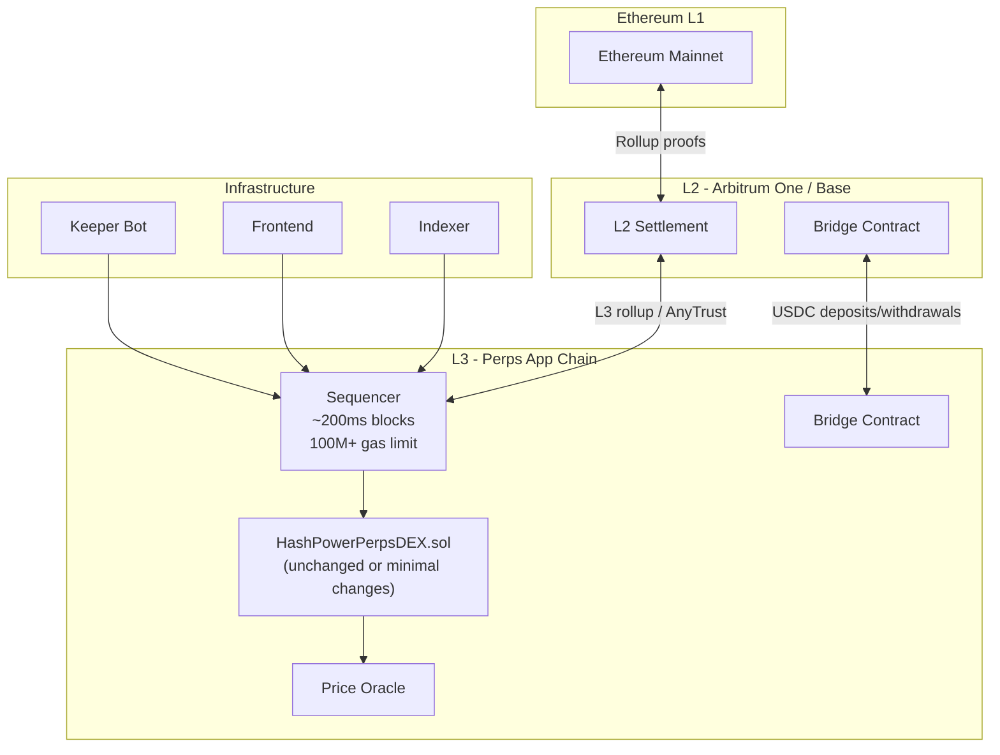
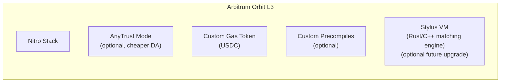
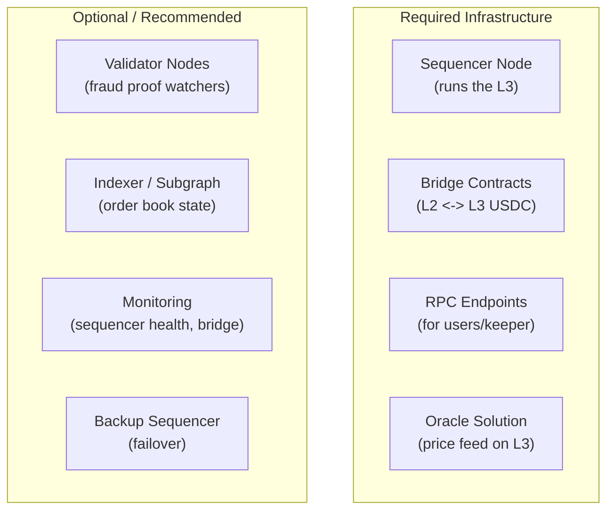

# Option D: EVM-Compatible L3 App-Specific Chain

## Summary

Deploy HashPowerPerpsDEX on a dedicated L3 app-specific chain (e.g., Arbitrum Orbit or OP Stack) that settles to an L2. This gives you full control over block gas limits, block time, fee structure, and even custom precompiles -- effectively removing the gas constraints that cause scaling bottlenecks while keeping the existing Solidity contract largely intact.

## Architecture

## How It Solves the Bottlenecks

### Bottleneck 1: Price Level Insertion -- O(P)

**Not a problem.** With a 100M+ gas block limit (vs 30M on L1), the linked list scan can handle 10x more price levels before hitting limits. With a dedicated sequencer, you can set the gas limit even higher.

### Bottleneck 2: Order Matching -- O(P x Q)

**Mitigated by gas headroom.** A 500M gas limit (configurable on Orbit chains) means matching can process ~50x more iterations per transaction. Combined with fast block times (~200-500ms), large orders can be split across multiple blocks if needed.

### Bottleneck 3: Unbounded View Functions

**Not a problem.** The sequencer node serves view calls locally with no gas limit for `eth_call`. Even `getUsersWithPositions()` with 100K users works fine as a local read.

### Bottleneck 4: Price Level Pollution / DoS

**Mitigated by cost control.** On a dedicated chain, you control:

- Gas price (can set minimum gas price high enough to deter spam)
- Custom gas token (use USDC as gas token to directly control cost)
- Transaction filtering at the sequencer level
- Whitelisting (optional: restrict who can submit orders)

## L3 Framework Options

### Arbitrum Orbit (Recommended)

**Why Orbit:**

- Permissionless deployment -- no approval needed
- AnyTrust mode for cheap data availability (DAC instead of posting to L1)
- Custom gas token support (pay fees in USDC)
- Custom precompiles for gas-intensive operations
- Stylus VM for future: rewrite matching engine in Rust for 10-100x gas savings
- Production examples: Ethereal (perps), Xai (gaming), Treasure Chain

**Configuration:**

- Block gas limit: 500M+ (configurable)
- Block time: 250ms (Orbit default with dedicated sequencer)
- Minimum gas price: set to deter spam while keeping real trades cheap
- Data availability: AnyTrust (cheapest) or posting calldata to L2

### OP Stack Alternative

**Why OP Stack:**

- Strict EVM equivalence (easiest migration)
- Superchain interop for cross-chain composability
- Strong tooling ecosystem

**Tradeoffs vs Orbit:**

- Less flexible gas configuration
- No Stylus VM equivalent
- No AnyTrust mode (must post all data to L1/L2)

## What Changes in HashPowerPerpsDEX.sol

### Minimal Changes Required

The beauty of the L3 approach: **the contract can remain largely unchanged.** The gas constraints that cause bottlenecks are solved at the infrastructure layer.

| Change                       | Required?         | Description                                                   |
| ---------------------------- | ----------------- | ------------------------------------------------------------- |
| Contract code                | No changes needed | Deploy as-is with higher gas limits                           |
| `MAX_ORDERS_PER_PARTICIPANT` | Optional increase | Could raise from 100 to 1000                                  |
| `minimumPriceIncrement`      | No change         | Already works                                                 |
| View functions pagination    | Nice to have      | Less urgent with no gas limit on reads                        |
| Oracle integration           | Update needed     | Need L3-compatible oracle (Chainlink on L3, or custom bridge) |

### Optional Enhancements (Post-Migration)

Once on L3, you can iteratively improve without gas pressure:

1. **Raise `MAX_ORDERS_PER_PARTICIPANT`** to 500-1000
2. **Add `MAX_PRICE_LEVELS`** cap as a safety measure (even though gas allows more)
3. **Custom precompile for matching** (Orbit only): implement the matching loop in Go for 10x gas reduction
4. **Stylus rewrite** (Orbit only, future): rewrite hot paths in Rust

## Infrastructure Requirements

### Sequencer

- Single sequencer (centralized but fast) or committee
- You run the sequencer -- full control over block production
- Risk: sequencer downtime = chain downtime (mitigated by backup/failover)

### Bridge

- Standard L2<->L3 bridge for USDC deposits/withdrawals
- ~15 min withdrawal time with fast finality (Orbit)
- 7-day challenge period for full security (standard optimistic rollup)

### Oracle

Options for price feeds on L3:

1. **Chainlink on L3:** If Chainlink supports the L3, use directly
2. **Bridge oracle:** Relay L2 oracle prices to L3 via cross-chain message
3. **Custom oracle:** Run your own oracle node that posts prices to L3
4. **Pyth/RedStone:** Pull-based oracles that work on any EVM chain

### Estimated Infrastructure Costs

| Component               | Monthly Cost     | Notes                                    |
| ----------------------- | ---------------- | ---------------------------------------- |
| Sequencer node          | $200-500         | Dedicated server, 8+ cores               |
| Validator node(s)       | $100-300         | 1-3 watchers for fraud proofs            |
| DA costs (AnyTrust)     | $50-200          | DAC members, minimal L1 posting          |
| DA costs (Rollup)       | $500-5000        | Posts all data to L2, scales with volume |
| RPC nodes               | $100-300         | Public endpoints for users               |
| Bridge monitoring       | $50-100          | Alert on unusual bridge activity         |
| **Total (AnyTrust)**    | **$500-1400/mo** |                                          |
| **Total (Full Rollup)** | **$950-6200/mo** |                                          |

## Migration Path

### Phase 1: Deploy L3 Chain (2-4 weeks)

1. Set up Arbitrum Orbit chain with AnyTrust DA
2. Configure custom gas token (USDC)
3. Deploy bridge contracts on L2
4. Set up sequencer and validator nodes

### Phase 2: Deploy Contracts (1 week)

1. Deploy HashPowerPerpsDEX.sol to L3 (via UUPS proxy)
2. Deploy or bridge oracle price feed
3. Deploy keeper bot targeting L3 RPC
4. Test end-to-end: deposit USDC via bridge -> trade -> withdraw

### Phase 3: Frontend Integration (1-2 weeks)

1. Update frontend to target L3 RPC
2. Add bridge UI for L2 <-> L3 deposits/withdrawals
3. Update indexer to read from L3

### Phase 4: Optional Optimizations

1. Raise order/price limits
2. Add custom precompiles if needed
3. Consider Stylus rewrite for hot paths

## Comparison: L3 vs Smart Contract Refactor

| Aspect                 | L3 App Chain                       | Contract Refactor (A/B/C)               |
| ---------------------- | ---------------------------------- | --------------------------------------- |
| Contract changes       | Minimal                            | Significant to complete rewrite         |
| Time to deploy         | 4-8 weeks                          | 2-8 weeks (depending on option)         |
| Ongoing cost           | $500-6000/mo infra                 | Zero (runs on existing chain)           |
| Gas limits             | Effectively unlimited              | Still bounded by host chain             |
| Latency                | ~200ms blocks                      | Depends on host chain (1-12s)           |
| User experience        | Bridge required for deposits       | Direct interaction on host chain        |
| Composability          | Isolated (bridge needed)           | Full composability with host chain DeFi |
| Security model         | Inherits from L2 + sequencer trust | Inherits from host chain                |
| Operational complexity | High (run chain infrastructure)    | Low (just a contract)                   |

## Limitations

- **Bridge UX friction:** Users must bridge USDC from L2 to L3 before trading. Adds a step and withdrawal delays.
- **Composability loss:** Cannot atomically compose with L2 DeFi (e.g., flash loans, vault strategies).
- **Operational burden:** Running a chain requires DevOps, monitoring, and incident response.
- **Sequencer centralization:** Single sequencer means trust assumption and single point of failure.
- **Oracle complexity:** Need a reliable price feed solution on the L3.

## When to Choose This

- You expect very high throughput (thousands of orders per second)
- Gas costs on the host chain are a concern for users
- You want to minimize contract changes and move fast
- You're willing to operate chain infrastructure
- Composability with L2 DeFi is not critical
- The product is mature enough to justify infrastructure investment

## Reference

- [Arbitrum Orbit Docs](https://docs.arbitrum.io/launch-orbit-chain/a-gentle-introduction)
- [Ethereal](https://ethereal.trade) -- production perps on Arbitrum Orbit
- [OP Stack Docs](https://docs.optimism.io/stack/getting-started)
