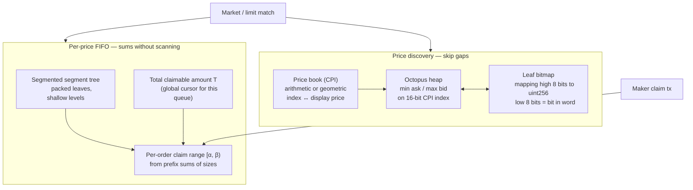

# Option E: LOBSTER (Clober Style — Segmented Segment Tree + Octopus Heap)

## Summary

Adopt the **LOBSTER** pattern (**L**imit **O**rder **B**ook with **S**egment **T**ree for **E**fficient o**R**der-matching) from the Clober team (see reference below): decouple settlement from the taker via **manual claiming** and **claim ranges**, maintain per-price **FIFO depth** with a **segmented segment tree** (few storage writes per update), and skip empty price **gaps** with an **octopus heap** plus **compressed price indices** (CPI). The goal is a fully on-chain book with bounded, EVM-friendly gas — not unbounded iteration over makers or ticks.

## Problems This Addresses

### 1. Iterating Over Makers to Settle

A single trade can touch many makers. Walking every maker in one transaction risks hitting gas or block limits. LOBSTER moves maker payout to **separate claim transactions**: the book only needs to maintain **how much** is claimable in aggregate and each order’s **claim interval** on the queue, not pay everyone in the taker’s tx.

### 2. Iterating Over Price Levels for Large Market Orders

Wide gaps between active prices make “walk every tick” prohibitively expensive. LOBSTER keeps a **heap of active price indices** and a **leaf bitmap** so the next non-empty price is found with **few storage reads**, not one per tick in the gap.

---

## Architecture (Conceptual)

---

## How It Works

### Claim Range and Manual Claiming

At a given price, orders sit in a **FIFO queue** (conceptually). For the *n*th order with size _f(n)_:

- **Claim range** \([α*n, β_n)\) where \(α_0 = 0\), \(α_n = \sum*{i<n} f(i)\), \(β_n = α_n + f(n)\).
- **Total claimable amount** _T_: cumulative size that has been “taken” against this queue (increases when liquidity is consumed).

For an order with interval \([a, b)\) and total _T_:

1. **\(b \leq T\)** — fully claimable.
2. **\(a < T < b\)** — partially claimable; amount \(\min(T - a, b - a)\).
3. **\(T \leq a\)** — not claimable.

So each maker’s entitlement is **derived from two scalars** (_T_ and their range) instead of iterating all predecessors in the settlement tx. Cancels that change sizes must keep prefix sums consistent — that is what the **segment tree** is for.

### Segmented Segment Tree (Per-Price Queue)

A classic segment tree gives **O(log N)** range sum and point update — but a naive EVM implementation does **one `sstore` per tree level** (e.g. ~16 levels for large _N_), which is too heavy.

**Segmentation** packs multiple leaves per storage slot (e.g. fixed **quote units** and **64-bit** sizes so **four leaves per 256-bit word**) and **recomputes** some parent nodes **in memory** from children stored in **two** slots (e.g. eight leaves spanning two words yield seven parents without storing them). That **reduces effective tree height** and **concentrates updates** into fewer slots — Clober reports on the order of **~4 `sstore`s** per update vs **~16** for a naive tree at similar capacity.

**Circular buffer:** an **order index** wraps modulo max queue length (e.g. 32,768 slots). A new order may **reuse** a leaf only if the order displaced far enough in the past is already claimed or evicted — so the limit is on **open** orders, not lifetime order count.

### Octopus Heap + Leaf Bitmap (Across Prices)

**CPI (compress price to index):** map display price to a **16-bit** (or similar) index via an **arithmetic or geometric** “price book” so only **valid** ticks use indices — no wasted bit patterns for impossible prices.

**Split index:** **high 8 bits** index a **compressed heap** (small heap stored across a **head** slot + **arm** slots — “octopus” shape). **Low 8 bits** select a bit in `mapping(uint8 => uint256)` **leaf bitmap** words. Often the next active price is found by **bit operations** on the bitmap in the **same** high-byte group, **without** updating the heap — heap updates become **rare** when liquidity clusters.

Together: **skip empty gaps** between prices with **bounded** work, instead of scanning every tick.

---

## What Changes in HashPowerPerpsDEX.sol

### Order Book and Settlement

| Current                                          | LOBSTER-style                                                           |
| ------------------------------------------------ | ----------------------------------------------------------------------- |
| Taker flow pays/consumes opposite side in one tx | Taker consumes liquidity; **makers claim** in separate txs (or batch)   |
| FIFO queues per price                            | FIFO with **claim ranges** + **segment tree** for prefix sums / updates |
| Linked list or scan for “next price”             | **Octopus heap** + **bitmap** + **CPI** for next active level           |
| Matching bounded by `maxFills` iteration         | Same **economic** bound; structure reduces **per-step** cost            |

### Likely Preserved or Adapted

- Margin, positions, funding, liquidation — **unchanged in principle**; only **order book storage and settlement API** change.
- Oracle and external interfaces — **mostly unchanged**; **claim** endpoints added for makers.

---

## Gas / Complexity (Qualitative)

| Area                               | Behavior                                                                                            |
| ---------------------------------- | --------------------------------------------------------------------------------------------------- |
| Update one order’s size / cancel   | **O(log N)** tree path; **constant small** number of `sstore`s if segmented design matches Clober’s |
| Query sum / prefix for claim check | **O(log N)**                                                                                        |
| Next active price after a fill     | Often **O(1)** bitmap in same bucket; heap **occasionally**                                         |
| Taker tx                           | Does **not** linearly scale with **number of makers** — they claim later                            |

Exact numbers depend on implementation (word packing, max levels, price book).

---

## Implementation Considerations

### Quote Unit and Overflow

Fixed **quote unit** for stored sizes (e.g. 0.000001 USDC) keeps leaf values in **64-bit** fields and avoids overflow if max depth per tick is realistic (see original analysis in the Clober write-up).

### UX: Claiming

Manual claiming adds **UX** and **MEV** considerations (when to claim, gas for small claims). Protocols often batch claims or incentivize keepers.

### Settlement vs Matching (vs Option C)

**Matching** here is split from **full per-maker settlement in the taker transaction**. The book updates **total claimable** _T_, **claim ranges**, segment-tree sums, and price-index structures (heap / bitmap) in **bounded** work — the design explicitly avoids having the taker’s tx **iterate every maker** to pay them.

**Settlement** of maker **positions / margin / balances** is deferred to **separate claim transactions** (or batches). Each claim still does **O(1)** or **O(log N)** work for that maker’s update, but the **taker tx** no longer carries **Θ(k)** maker account updates for _k_ fills in one shot.

**Compared to Option C (radix tree):** Option C’s **tree walk and subtree removal** cap **order-book** work at **O(log N)** for the match decision, but if the contract **materializes every maker’s position** inside the same tx as the match, **on-chain settlement** can still scale with **how many makers were filled** — the same **matching vs settlement** gap. Option E **addresses that gap by design** by moving maker payout / position realization to **claims**, at the cost of **extra txs**, **UX**, and **total-system gas** (many small claims vs one fat taker tx).

Neither option removes the need to **eventually** update each maker’s state unless the protocol uses **pure aggregate accounting** with no per-user writes at fill time (unusual for perps).

### Price Book

**Arithmetic vs geometric** progression must match how your perp **ticks** are defined; migration from `minimumPriceIncrement` alone may require a deliberate **CPI** design.

### Auditing

This is **novel on-chain engineering** (segmented trees + heap layout). Expect **audit** focus on overflow, wraparound of the circular buffer, and heap invariants.

---

## Limitations

- **Implementation complexity** — significantly higher than tick bitmap + FIFO queues.
- **Claiming model** — product and legal/UX implications vs atomic settlement.
- **Not a drop-in library** — Clober-style layouts are **custom**; no standard OpenZeppelin equivalent.
- **Capacity constants** — max orders per price and CPI width are **protocol parameters**; wrong choices force upgrades or new markets.

---

## When to Choose This

- You want a **fully on-chain** book with **Clober-class** gas discipline.
- You accept **manual claiming** (or a hybrid) to avoid **unbounded maker iteration** in one tx.
- You can invest in **custom data structures** and **security review**.

---

## Reference

- [Enabling on-chain order matching for order book DEXs — Revisited: Segmented segment trees and octopus heaps explained](https://ethresear.ch/t/enabling-on-chain-order-matching-for-order-book-dexs-revisited-segmented-segment-trees-and-octopus-heaps-explained/15180) (Ethereum Research, dev-clober, 2023) — primary explanation of LOBSTER, segmented segment trees, octopus heap, and CPI.

- Source code: [Clober](https://github.com/clober-dex/v2-core)
