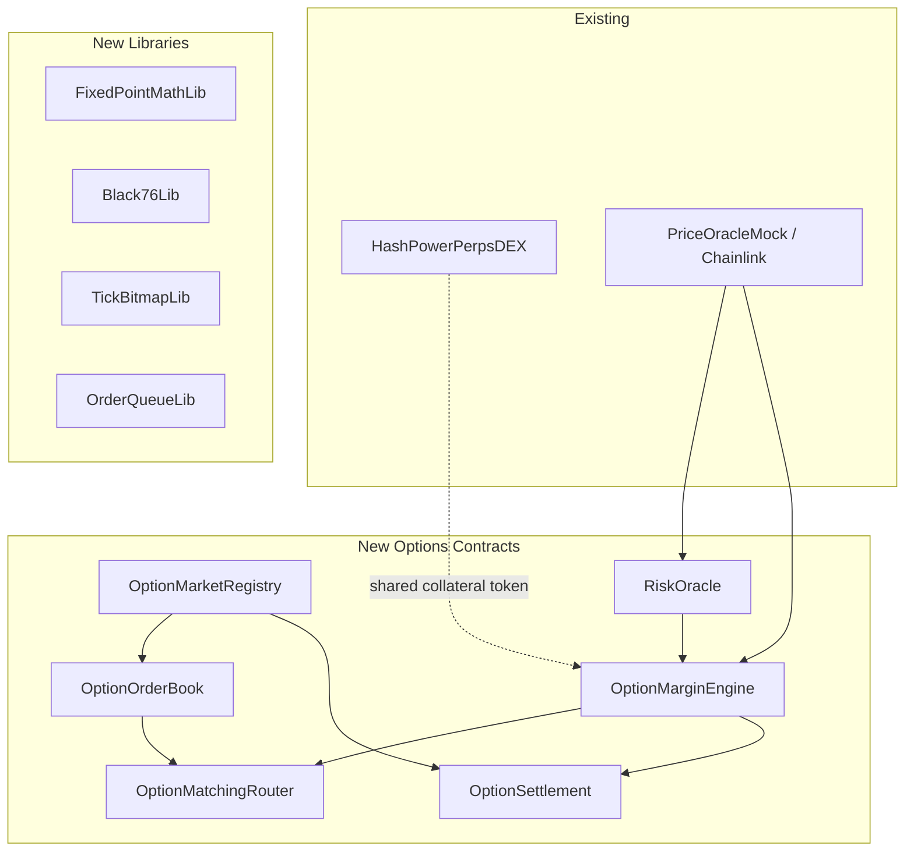

# Fully On-Chain CLOB Options on Perps

## Chat Summary

The research conversation covered options fundamentals, spot/futures/perps options differences, everlasting options, on-chain vs off-chain matching tradeoffs, MM churn reduction (skipped per request), Greeks-based margin, Black-76 pricing, and settlement mechanics. The final consolidated design is in [OPTIONS_DESIGN.md](contracts/docs/OPTIONS_DESIGN.md).

Key decisions reached:

- **European cash-settled** options on the perp mark/index price
- **Fully on-chain CLOB** with price-time priority (same pattern as existing perps)
- **Black-76** pricing model (natural for perps underlying)
- **Greeks-based portfolio margin** (delta, gamma, vega via stress scenarios)
- **Oracle-fed risk surface** (ATM vol + skew + term parameters)
- **Automatic settlement** at expiry via TWAP/TWMP

---

## Existing Codebase

The current system lives in [HashPowerPerpsDEX.sol](contracts/contracts/HashPowerPerpsDEX.sol) -- a single UUPS-upgradeable contract containing the perps CLOB, margin engine, funding, and liquidation. It uses:

- `StructuredLinkedList` for sorted price levels (bid/ask)
- Per-price-level FIFO queues for order matching
- Account-based collateral as ERC20 receipt tokens (minted on the contract itself)
- Chainlink-style oracle via [AggregatorV3Interface](contracts/contracts/AggregatorV3Interface.sol)
- `EnumerableSet` for per-user order tracking

---

## Architecture

Six new contracts/libraries, deployed alongside (not inside) the existing perps contract. They share the same collateral vault but operate independently.



### Contract Responsibilities

- **OptionMarketRegistry** -- defines option series (`seriesId`, `underlyingId`, `strike`, `expiry`, `isCall`, tick/lot sizes), activates/freezes/expires series, binds to perp market
- **OptionOrderBook** -- per-series bid/ask books with price-level linked lists + FIFO queues, best bid/ask tracking, tick bitmap for next-level lookup
- **OptionMatchingRouter** -- orchestrates order placement: pre-trade margin check, book traversal, fill settlement, resting insertion; supports IOC/FOK/postOnly/reduceOnly
- **OptionMarginEngine** -- account state (cash balance, option positions, perp positions), per-account net Greeks, IM/MM computation via stress scenarios, health checks, collateral deposits/withdrawals
- **RiskOracle** -- publishes vol surface parameters (ATM vol, skew, term slope), perp reference price, settlement price finalization; admin-controlled with staleness guards
- **OptionSettlement** -- freezes settlement reference at expiry (TWAP), computes intrinsic payoffs, cash-settles all open positions, closes series

### Key Data Structures

```solidity
struct OptionSeries {
    uint64 seriesId;
    bytes32 underlyingId;       // e.g. keccak256("BTC-PERP")
    uint64 expiryTs;
    uint64 strikeE8;            // 1e8 precision
    bool isCall;
    uint32 tickSizeE8;
    uint32 lotSize;
    bool active;
    bool settled;
}

struct Order {
    uint64 orderId;
    uint64 seriesId;
    address trader;
    bool isBuy;
    uint64 priceTicks;          // premium in ticks
    uint128 size;
    uint128 remaining;
    uint64 seq;                 // global monotonic counter
    uint64 prev;                // linked list
    uint64 next;
    bool postOnly;
    bool reduceOnly;
    bool active;
}

struct AccountState {
    int256 cashBalance;
    // option positions: seriesId => signed quantity (+long/-short)
    // perp hedge positions (read from perps DEX)
    int256 netDeltaE18;
    int256 netGammaE18;
    int256 netVegaE18;
    uint256 initialMargin;
    uint256 maintenanceMargin;
}

struct RiskSurface {
    uint64 updatedAt;
    uint64 refPriceE8;
    uint64 atmVolE6;            // 1e6 precision
    int32 skewE6;
    int32 termSlopeE6;
    uint32 maxPriceMoveBps;
    uint32 maxVolMoveBps;
}
```

---

## Margin Model

The margin engine uses a **stress-scenario** approach, not naive Greeks-only:

1. Compute **mark-to-model PV** of all option legs via Black-76
2. Compute **perp unrealized PnL** from reference price
3. Compute **net Greeks** (delta, gamma, vega) across the portfolio
4. Run stress scenarios: underlying +/-5%, +/-10%, +/-15% combined with vol +/-20%, +/-40%
5. **IM** = worst scenario loss + liquidity buffer + short-option floor
6. **MM** = lower multiple of the same framework

For resting orders, the v1 policy is conservative: each resting order reserves **standalone IM**; portfolio offsets apply only to filled positions.

The collateral formula per account:

```
Margin ~= |delta| * maxShock + 0.5 * gamma * maxShock^2 + vega * volShock
```

---

## Black-76 On-Chain

Black-76 is used because the underlying is a perp (forward-like). Inputs: forward F (perp reference), strike K, time-to-expiry T, implied vol sigma, discount factor D (simplified for stablecoin).

The on-chain implementation uses:

- A compact `exp`/`ln`/`sqrt` library (fixed-point, 18 decimals)
- Rational approximation for the normal CDF `N(x)` (Abramowitz & Stegun or similar, ~30k gas)
- Greeks computed as analytic derivatives of the Black-76 formula
- Per-series vol derived from `RiskSurface` via interpolation (ATM vol + strike-dependent skew adjustment)

---

## Order Lifecycle

### Place Order

1. Validate series active, price on tick, quantity on lot, side
2. Margin engine checks worst-case IM after adding this order
3. Try immediate match against opposing book (walk levels best-first)
4. Each fill: decrement sizes, transfer premium, update positions, recompute touched-account Greeks incrementally
5. Residual rests on book (unless IOC/FOK), reserve standalone IM

### Fill

1. Premium flows buyer -> seller immediately
2. Positions update (+long/-short)
3. Per-account Greeks/PV recomputed for touched series only
4. IM/MM recomputed; revert if post-trade health fails (except liquidation)

### Cancel

1. Remove from queue, release reserved IM, emit event

### Expiry Settlement

1. Keeper calls `settleExpiry(seriesId)` after expiry timestamp
2. Contract freezes final reference using oracle TWAP window
3. For each holder: `payoff = max(S_T - K, 0)` (call) or `max(K - S_T, 0)` (put)
4. Cash settle long/short, close series permanently, block new orders

---

## Liquidation

Portfolio-aware, not per-order:

- Anyone calls `liquidate(account)`
- Contract checks `health < MM`
- Partial liquidation: reduce worst-risk legs first (short convexity before long)
- Liquidator fee from account balance
- Insurance fund backstops residual bad debt

---

## Events

```solidity
event SeriesCreated(uint64 indexed seriesId, bytes32 underlyingId, uint64 strike, uint64 expiry, bool isCall);
event SeriesExpired(uint64 indexed seriesId, uint64 settlementPrice);
event OrderPlaced(uint64 indexed orderId, uint64 indexed seriesId, address trader, bool isBuy, uint64 price, uint128 size);
event OrderCanceled(uint64 indexed orderId);
event OrderFilled(uint64 indexed takerOrderId, uint64 indexed makerOrderId, uint64 price, uint128 fillSize);
event AccountHealthUpdated(address indexed account, uint256 im, uint256 mm, int256 health);
event RiskSurfaceUpdated(bytes32 indexed underlyingId, uint64 atmVol, int32 skew);
event Liquidated(address indexed account, address liquidator, uint256 fee);
```

---

## Implementation Phases

### Phase 1: Libraries (week 1-2)

- `FixedPointMathLib.sol` -- 18-decimal fixed-point mul/div/exp/ln/sqrt
- `Black76Lib.sol` -- call/put PV, delta, gamma, vega from Black-76
- `TickBitmapLib.sol` -- bitmap for tracking non-empty price levels
- `OrderQueueLib.sol` -- doubly-linked FIFO queue per price level

### Phase 2: Registry + Static Book (week 2-3)

- `OptionMarketRegistry.sol` -- series CRUD, validation, expiry status
- `OptionOrderBook.sol` -- single-series place/cancel/match with price-time priority
- Tests: FIFO correctness, best bid/ask, partial fills, cancel head/middle/tail

### Phase 3: Collateral + Risk Oracle (week 3-4)

- Collateral integration (deposit/withdraw, premium transfers, withdrawal blocked on insufficient health)
- `RiskOracle.sol` -- vol surface publication, staleness checks, settlement price finalization
- Tests: deposit/withdraw, premium settlement, stale oracle rejection

### Phase 4: Margin Engine (week 4-6)

- `OptionMarginEngine.sol` -- account positions, Greeks aggregation, Black-76 PV, scenario margin
- Pre-trade margin checks, post-fill recalculation
- Resting order IM reservation
- Tests: short option IM > long, portfolio netting with perp hedge, scenario monotonicity

### Phase 5: Matching Router + Trade Integration (week 6-7)

- `OptionMatchingRouter.sol` -- full order lifecycle orchestration
- IOC/FOK/postOnly/reduceOnly support
- Multi-series support (independent books per series)
- Tests: cross-series isolation, order type behaviors, margin-blocked placements

### Phase 6: Settlement + Liquidation (week 7-9)

- Expiry settlement: TWAP reference fixing, payoff computation, automatic cash settlement
- Liquidation: health checks, partial liquidation, insurance fund
- Tests: ITM/OTM/ATM settlement, post-expiry rejection, liquidation restores health, bad debt path

### Phase 7: Integration + Indexer (week 9-10)

- Connect options margin engine to existing perps positions for portfolio offsets
- Indexer schema for options book, fills, positions, Greeks
- Gas optimization pass (compact structs, incremental Greek updates, cached best prices)

---

## V1 Scope Constraints

- European cash-settled options only
- Single stablecoin collateral (USDC)
- Black-76 with oracle-fed vol buckets (no full smile calibration on-chain)
- Conservative standalone IM for resting orders
- Partial liquidation, no complex auctions
- No cross-asset offsets beyond same-underlying perp + options family
- No MM churn optimizations (quote templates, block-based repricing)

---

## Key Risks

- **Correct reservation** of margin for resting short-option orders
- **Deterministic and manipulation-resistant** settlement reference (TWAP window design)
- **Incremental portfolio risk updates** without mismatch bugs
- **Partial liquidation logic** for mixed perp + option portfolios
- **Gas blowups** on multi-fill orders across many maker accounts
- **On-chain Black-76 gas cost** (~30-50k per evaluation; must limit per-tx evaluations)
