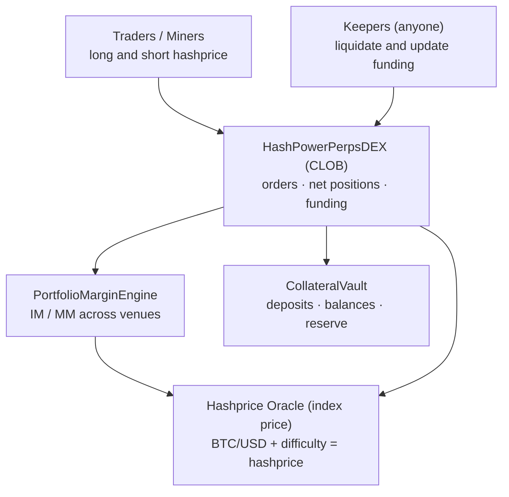

# Hash Power Perps

Decentralized Perpetual Market for Bitcoin Hashprice

---

## Introduction

Hash Power Perps is a decentralized perpetuals exchange for **Bitcoin
hashprice** — the daily USD revenue of a unit of mining hashrate. It lets
miners hedge their production and traders take leveraged long/short exposure
to hashrate as an asset class, with no expiry and no physical delivery.

Unlike the [Hashprice Futures](../../../futures-marketplace/docs/01.Overview.md)
market (dated, cash-settled contracts), a perpetual position never matures.
It stays open until you close it or it is liquidated, and a periodic
**funding** payment keeps its price tethered to the oracle hashprice.

The exchange is a fully on-chain **central limit order book (CLOB)**: orders
rest on a fixed price grid, match by price-time priority, and settle
directly against collateral held in a shared vault.

## Key Features

| Feature                     | Description                                                                 |
| --------------------------- | --------------------------------------------------------------------------- |
| **Perpetual exposure**      | No expiry — hold a long or short hashprice position indefinitely             |
| **On-chain CLOB**           | Limit orders on a fixed price grid, matched FIFO by price-time priority      |
| **Net-position accounting** | One aggregated position per account at a weighted-average entry price        |
| **Funding mechanism**       | Periodic payments tether the book mark price to the oracle index price       |
| **Portfolio margin**        | A shared collateral vault backs both Perps and Futures with unified margin   |
| **Permissionless liquidation** | Anyone can liquidate an undercollateralized account down to its IM buffer |

## Architecture

## How It Works

### 1. Deposit collateral

Deposit the settlement token (e.g. USDC) into the shared **CollateralVault**.
Your vault balance is a single pool of margin that backs your positions on
both Perps and Futures. See [Collateral & Accounts](./02.Collateral-and-Accounts.md).

### 2. Place an order

Call `createOrder(price, quantity, timeInForce)` with a signed quantity — positive to buy
(long), negative to sell (short). The order matches immediately against the
opposite side up to your limit price; any unfilled remainder rests on the
book. See the [Trading Guide](./03.Trading-Guide.md).

### 3. Hold a net position

Fills fold into a single net position at a weighted-average entry price.
While it is open you accrue/pay **funding** and unrealized PnL tracks the
mark price. See [Positions & Funding](./04.Positions-and-Funding.md).

### 4. Manage risk

Your account must stay above its Maintenance Margin. If it falls below,
anyone can liquidate it — closing only as much as needed to restore the
Initial Margin buffer. See [Margin & Liquidation](./05.Margin-and-Liquidation.md).

### 5. Close when you want

There is no maturity. Close (or reduce) by submitting an opposite-side
order; the offset realizes PnL on the closed portion. Withdraw free
collateral from the vault at any time, subject to margin.

## Index vs. Mark Price

| Price       | Source                                   | Used for                          |
| ----------- | ---------------------------------------- | --------------------------------- |
| Index price | Hashprice oracle (`getMarketPrice()`)    | PnL, margin, funding index leg    |
| Mark price  | Order-book mid `(bestBid + bestAsk) / 2` | Funding mark leg                  |

Funding nudges the book toward the oracle: when the book trades above the
index, longs pay shorts, and vice versa.

## Documentation

| Document                                                     | Description                                            |
| ------------------------------------------------------------ | ------------------------------------------------------ |
| [Collateral & Accounts](./02.Collateral-and-Accounts.md)     | Depositing, withdrawing, the shared vault, balances    |
| [Trading Guide](./03.Trading-Guide.md)                       | Placing orders, the CLOB, matching, order lifecycle    |
| [Positions & Funding](./04.Positions-and-Funding.md)         | Net positions, entry price, PnL, the funding mechanism |
| [Margin & Liquidation](./05.Margin-and-Liquidation.md)       | Margin thresholds and the close-to-IM liquidation flow |
| [Fees](./06.Fees.md)                                         | Taker/maker fees, the minimum taker fee, fee routing   |

## Security Considerations

- **Upgradeable**: UUPS proxy pattern for fixes and improvements.
- **Access control**: Admin parameters are owner-only; trading, funding
  updates, and liquidations are permissionless.
- **Oracle safeguards**: Staleness and non-positive-price checks reject
  trading on bad oracle data (`OracleStale`, `InvalidOracle`).
- **Shared collateral**: The vault only lets authorized markets move balances
  internally; withdrawals are margin-checked across the whole portfolio.
