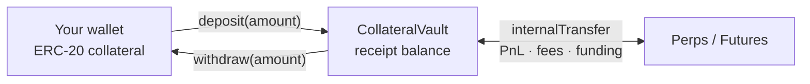

# Collateral & Accounts

Everything you trade on Hash Power Perps is backed by collateral held in a
shared **CollateralVault**. This page explains how collateral gets in and
out, how your balance is used, and why it is shared with the Futures market.

---

## The shared collateral vault

Perps does **not** custody tokens itself. Collateral lives in a separate
`CollateralVault` contract that is shared across the Hash Power venues
(Perps and Futures). The DEX only asks the vault to move balances internally
when trades, fees, funding, or liquidations settle.



When you `deposit`, the vault pulls your ERC-20 collateral and credits you an
equal **receipt balance**. `HashPowerPerpsDEX.balanceOf(you)` simply reads
that vault balance.

## Depositing

Call the vault directly:

| Function                                          | Use                                                        |
| ------------------------------------------------- | ---------------------------------------------------------- |
| `deposit(amount)`                                 | Pull `amount` of collateral from you, credit your balance  |
| `depositForPermit(recipient, amount, deadline, v, r, s)` | Approve + deposit in one transaction (ERC-2612 permit) |
| `depositFor(recipient, amount)`                   | Deposit on behalf of another account                       |

Before `deposit`, approve the vault to spend your collateral (or use
`depositForPermit` to combine approval and deposit in a single transaction).

## Withdrawing

```
withdraw(amount)
```

Withdrawals burn your receipt balance and return the underlying token. A
withdrawal **reverts if it would breach your portfolio margin** — you can
only take out collateral that is not backing an open position or resting
order (your *free* / excess margin).

## One balance, two venues (portfolio margin)

Your vault balance is a **single pool of margin** that backs positions on
both Perps and Futures at the same time. Margin requirements are computed at
the **portfolio** level by the `PortfolioMarginEngine`, so offsetting
exposure across venues can reduce the total margin you need, and a
withdrawal is checked against your combined requirement.

Practical consequences:

- Depositing once funds trading on both venues.
- A loss (or owed funding) on one venue reduces the collateral available to
  the other.
- Your Perps liquidation threshold depends on your **whole** portfolio, not
  just your Perps position.

## Your balance components

At any time your vault balance is conceptually split into:

| Component            | Meaning                                                         |
| -------------------- | -------------------------------------------------------------- |
| Initial Margin (IM)  | Locked to **open / increase** exposure                         |
| Maintenance Margin (MM) | The floor below which you become liquidatable               |
| Order margin         | Extra IM your resting (unmatched) orders add, after netting them against your positions |
| Free / excess margin | Withdrawable collateral above all requirements                 |

Useful views:

- `balanceOf(user)` — total vault balance.
- `computePortfolioIM(user)` / `computePortfolioMM(user)` on the margin engine — current IM / MM across all products.
- `orderMarginOf(user)` on the margin engine — collateral reserved by resting orders. Portfolio-wide, not per-venue: the engine nets each market's resting-order delta into your total before stressing it, so an order that only moves you toward flat reserves nothing. The figure moves with the price; it is not a fixed amount set when you placed the order.
- `getUnrealizedPnl(user)` — mark-to-market PnL on the open position.
- `getPendingFunding(user)` — unsettled funding (positive = you owe).

## The insurance fund

The vault holds a protocol-owned **insurance fund** account
(`INSURANCE_FUND_ADDR`). It is the counterparty ledger for:

- **Fees** — taker/maker fees are paid into it (see [Fees](./06.Fees.md)).
- **Funding** — funding payments flow to/from it.
- **PnL & bad debt** — realized PnL settles against it; if a liquidated
  account can't cover its loss, the shortfall is **absorbed by the insurance
  fund** (never taken from other users). See
  [Margin & Liquidation](./05.Margin-and-Liquidation.md).

---

## Read next

- [Trading Guide](./03.Trading-Guide.md) — place your first order.
- [Margin & Liquidation](./05.Margin-and-Liquidation.md) — keep your account healthy.
