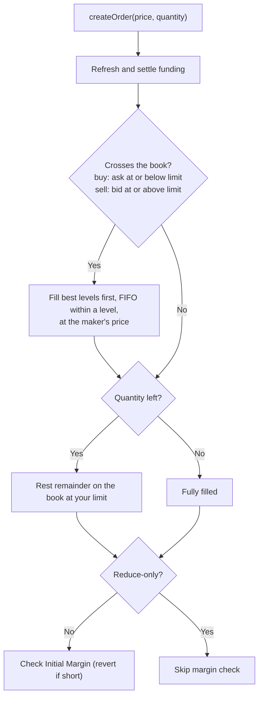

# Trading Guide

This guide covers how to trade on Hash Power Perps: the order book model,
placing and matching orders, and managing their lifecycle.

---

## Prerequisites

1. **Collateral deposited** in the shared vault — see
   [Collateral & Accounts](./02.Collateral-and-Accounts.md).
2. **Wallet** connected to the correct network.
3. Enough **free margin** to cover the Initial Margin of the order you place.

---

## The order book model

Hash Power Perps is a fully on-chain **central limit order book (CLOB)**:

- Orders rest on a **fixed price grid**. Every price must be a multiple of
  `minimumPriceIncrement` (the tick size); off-grid prices revert
  `InvalidPrice`.
- Each side keeps **sorted price levels** — bids high-to-low, asks
  low-to-high — and within a level orders queue **FIFO** (price-time
  priority).
- Quantities use `QUANTITY_DECIMALS = 6` and are **signed**: positive = long
  (buy), negative = short (sell).

There is a single entry point for trading — `createOrder` — which behaves as
both a marketable (aggressive) order and a resting (passive) order depending
on the book.

## Placing an order

```solidity
createOrder(uint256 price, int256 quantity)
```

- `price` — your **limit** price (must be on the tick grid).
- `quantity` — signed size. Positive buys/longs, negative sells/shorts.

What happens, in order:

1. Global funding is refreshed and your funding is settled.
2. The order **matches immediately** against the opposite side, walking
   prices from best toward your limit:
   - A **buy** fills against asks priced **at or below** your limit.
   - A **sell** fills against bids priced **at or above** your limit.
3. Any quantity left after matching **rests** on the book at your limit price
   (subject to the limits below).
4. Unless the order is *reduce-only*, your Initial Margin is checked
   (`_ensureInitialMargin`); insufficient free margin reverts.

To trade like a **market order**, submit an aggressive limit price (e.g. far
through the book); it fills against everything up to that price and rests the
remainder. To trade **passively**, price it away from the top of book so it
rests as a maker order.

### Simulating first

`simulateOrder(price, quantity)` is a read-only preview that returns the
`filledQuantity`, the volume-weighted `averageFillPrice`, and the
`remainingQuantity` that would rest — without sending a transaction.

## How matching works

Orders match when they cross:

1. **Crossing price** — buy limit ≥ ask, or sell limit ≤ bid.
2. **Opposite direction** — buys take from the ask queue, sells from the bid
   queue.
3. **FIFO within a level** — the oldest maker order at a price fills first.

Trades execute at the **maker's price**, so an aggressive taker gets price
improvement when the resting order is better than its limit.



Example book depth (asks high→low, bids high→low; each level is a FIFO queue):

| Side | Price | Resting queue (oldest first) |
| ---- | ----- | ---------------------------- |
| Ask  | 4.15  | Seller A                     |
| Ask  | 4.14  | Seller B                     |
| Ask  | 4.12  | Seller C                     |
| Bid  | 4.11  | Buyer Y, Buyer Z             |
| Bid  | 4.10  | Buyer W                      |

- New **buy @ 4.12** → fills Seller C at 4.12.
- New **sell @ 4.11** → fills Buyer Y first (oldest in the queue).

`getBestBidPrice()` / `getBestAskPrice()` return the top of book, and
`getQuantityAtPrice(price, isBid)` the resting size at a level.

## Positions from fills

Each fill updates your single **net position** rather than creating separate
lots:

- Adding in the same direction updates your **weighted-average entry price**.
- Trading the opposite direction **reduces** the position (realizing PnL on
  the closed part), and if it exceeds your size, **flips** you to the other
  side at the new price.

See [Positions & Funding](./04.Positions-and-Funding.md) for the details.

## Reduce-only fills skip the margin check

If an order is on the opposite side of your current position and does not
exceed its size, it is treated as **reduce-only** and skips the Initial
Margin check — you can always de-risk, even when close to your margin
limits.

## Closing or reducing a position

There is no expiry and no settlement step. To close, submit an opposite-side
order:

```
Open:  +1.0 long  @ 4.10
Close: -1.0 sell  @ 4.14

Realized PnL = (4.14 − 4.10) × 1.0 = 0.04 per unit (before fees/funding)
```

Fully offsetting flattens the position; partially offsetting leaves a smaller
position at the **same** entry price.

## Cancelling resting orders

```solidity
cancelOrder(bytes32 orderId)
```

Removes your unmatched order from the book and releases the margin it
reserved. Only the order's owner can cancel it (`OrderNotBelongToSender`).

## Order limits

| Limit                       | Value / rule                                                    |
| --------------------------- | -------------------------------------------------------------- |
| Price grid                  | Multiple of `minimumPriceIncrement` (else `InvalidPrice`)      |
| Max resting orders per user | `MAX_ORDERS_PER_PARTICIPANT = 100` (`MaxOrdersPerParticipantReached`) |
| Max price levels per side   | `MAX_PRICE_LEVELS_PER_SIDE = 200` (`MaxPriceLevelsReached`)     |
| Minimum margin per order    | `minimumMarginPerOrder` if set (`OrderMarginTooLow`)           |
| Quantity                    | Non-zero, `QUANTITY_DECIMALS = 6` (`InvalidSize`)              |

## Useful views

| View                                | Returns                                              |
| ----------------------------------- | ---------------------------------------------------- |
| `simulateOrder(price, qty)`         | Preview fill / average price / resting remainder     |
| `getBestBidPrice()` / `getBestAskPrice()` | Top of book                                    |
| `getQuantityAtPrice(price, isBid)`  | Resting quantity at a price level                    |
| `getOrder(orderId)`                 | A single order                                       |
| `getUserOrders(user)`               | A user's open order ids                              |

---

## Read next

- [Positions & Funding](./04.Positions-and-Funding.md) — what happens after a fill.
- [Fees](./06.Fees.md) — what each trade costs.
