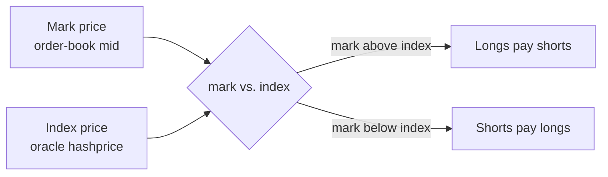

# Positions & Funding

Once your orders fill you hold a **net position**. This page explains how
that position is tracked, how PnL works, and how **funding** keeps the
perpetual tethered to the oracle hashprice.

---

## Net-position accounting

Each account has exactly **one** position per market, not a list of lots:

```solidity
struct Position {
    int256  netQuantity;         // + = long, − = short (QUANTITY_DECIMALS = 6)
    uint256 aggregatedEntryPrice; // weighted-average entry price
}
```

Every fill folds into this single position.

### Adding to a position (same direction)

The entry price becomes the **notional-weighted average** of the old and new
fills:

```
newEntry = (|oldQty|·oldEntry + |fillQty|·fillPrice) / |oldQty + fillQty|
```

Example:

```
Have:  +2 long @ 4.00
Buy:   +1 long @ 4.30

netQuantity        = +3
aggregatedEntry    = (2·4.00 + 1·4.30) / 3 = 4.10
```

### Reducing a position (opposite direction)

Trading against your position realizes PnL on the closed slice at the trade
price; the entry price of the remainder is **unchanged**:

```
Have:  +3 long @ 4.10
Sell:  −1      @ 4.25

Realized PnL = (4.25 − 4.10) × 1 = 0.15
Remaining    = +2 long @ 4.10  (entry unchanged)
```

### Flipping

If an opposite order is **larger** than your position, the position closes
fully (realizing PnL on the old size) and a **new** position opens on the
other side, sized by the excess, at the trade price.

## Unrealized PnL

Marked continuously against the oracle **index price**:

```
Unrealized PnL = (mark price − aggregatedEntryPrice) × netQuantity / 10^QUANTITY_DECIMALS
```

Because `netQuantity` is signed, longs profit when price rises and shorts
profit when price falls. Read it with `getUnrealizedPnl(user)`.

> Realized PnL settles against the insurance fund. A winning close is paid
> from the fund; a losing close pays into it. If the fund cannot cover a
> winning partial close, the close reverts `InsufficientReservePool`.

---

## Funding

A perpetual has no expiry to force its price back to fair value, so a
periodic **funding** payment does it instead. When the order book trades
**above** the oracle, longs pay shorts; when it trades **below**, shorts pay
longs. This incentivizes traders to push the book back toward the index.

### The two prices

| Leg          | Source                                          |
| ------------ | ----------------------------------------------- |
| Mark price   | Order-book mid — `(getBestBidPrice() + getBestAskPrice()) / 2` |
| Index price  | Hashprice oracle — `getMarketPrice()`           |

If either side of the book is empty, no new funding accrues.

### The funding rate

```
fundingRate = (markPrice − indexPrice) / indexPrice        (per funding period)
```

clamped to ±`fundingRateMaxBps` per `fundingPeriod` (both owner-configured).
A positive rate means the book is rich → longs pay shorts.



### How it accrues and settles

- A **global cumulative funding index** (`cumulativeFundingPerUnit`) grows
  over time at the current rate. Anyone can advance it with `updateFunding()`,
  and it is refreshed automatically before every order, cancel, and
  liquidation.
- Each account stores a **snapshot** of that index taken when its position
  was last touched. Your owed/received funding is:

```
funding = netQuantity × (cumulativeIndexNow − yourSnapshot) / (10^QUANTITY_DECIMALS · 10^FUNDING_DECIMALS)
```

- Funding is **settled into your vault balance** (against the insurance
  fund) whenever your position is touched — before any size change so it is
  charged on the old size. Positive = you pay, negative = you receive.
- If you owe funding but can't cover it, the shortfall is recorded as
  `BadDebt` and absorbed by the insurance fund.

### Checking funding

- `getPendingFunding(user)` — unsettled funding accrued so far (positive =
  you owe, negative = you receive).
- The `FundingUpdated` and `FundingSettled` events track the global index and
  per-user settlements.

> **Funding affects your margin.** Owed funding is settled out of your
> balance, moving you closer to your maintenance threshold. Account for it
> when sizing collateral.

---

## Position views

| View                      | Returns                                         |
| ------------------------- | ----------------------------------------------- |
| `getUserPosition(user)`   | `{ netQuantity, aggregatedEntryPrice }`         |
| `getUnrealizedPnl(user)`  | Mark-to-market PnL                              |
| `getPendingFunding(user)` | Unsettled funding                               |

Position-holder lists are maintained off chain from indexed events; the contract
does not expose global participant enumeration.

---

## Read next

- [Margin & Liquidation](./05.Margin-and-Liquidation.md) — staying solvent.
- [Fees](./06.Fees.md) — trading costs.
