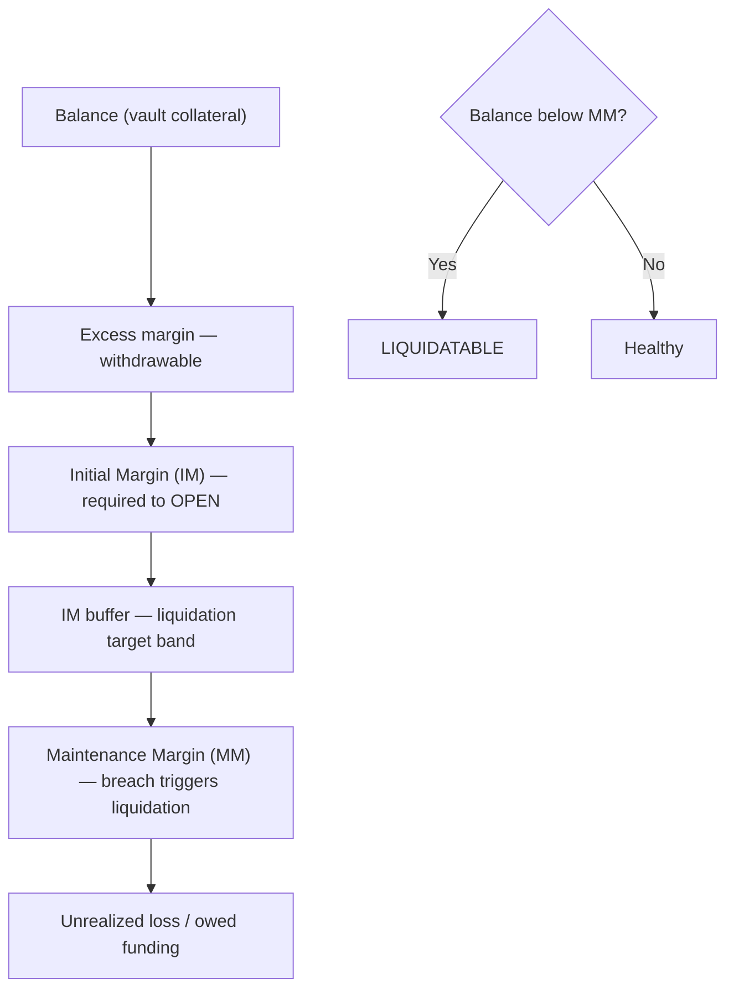
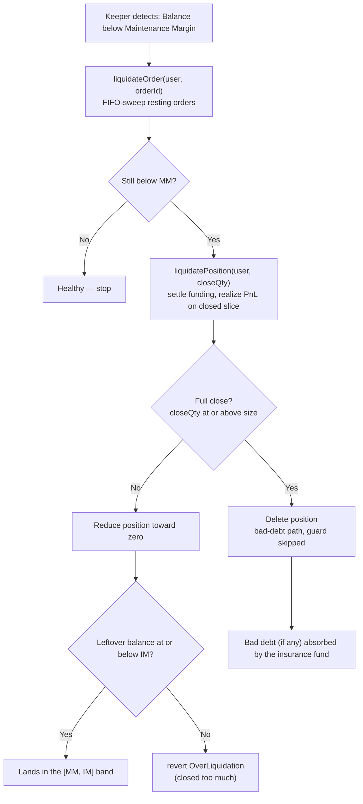

# Margin & Liquidation

The Hash Power Perps margin system keeps every open position collateralized
so the protocol and its counterparties are protected from default. Each user
holds a single **net position** (an aggregated `netQuantity` at an
`aggregatedEntryPrice`); margin is evaluated at the **portfolio** level and
undercollateralized accounts are liquidated back toward their Initial Margin
buffer.

---

## Overview

Margin is collateral deposited into the shared vault to guarantee a
position's obligations. The contract continuously values each account against
two thresholds computed by the `PortfolioMarginEngine`:



- **`computePortfolioMM(user)`** — maintenance margin (lower). Falling
  below it makes the account liquidatable.
- **`computePortfolioIM(user)`** — initial margin (higher). Required to
  open or increase a position, and the target that liquidation restores an
  account to.

Both are derived from the account's net exposure and the engine's spot
shocks (`mmSpotShock` for MM, `imSpotShock` for IM), so `IM ≥ MM` whenever
a real buffer is configured. Because margin is portfolio-wide, your Perps
threshold depends on your combined Perps + Futures exposure (see
[Collateral & Accounts](./02.Collateral-and-Accounts.md)).

---

## Margin Types

### 1. Deposited Collateral (Balance)

The account's vault balance (`balanceOf(user)`), in collateral-token
decimals. Funding payments and realized PnL move in and out of this
balance.

### 2. Maintenance Margin (MM)

The minimum collateral required to keep the net position open. Conceptually:

```
MM ≈ |netQuantity| × mark price × mmSpotShock
```

### 3. Initial Margin (IM)

The higher requirement enforced when opening or increasing exposure, and
the level liquidation aims to restore:

```
IM ≈ |netQuantity| × mark price × imSpotShock      (imSpotShock ≥ mmSpotShock)
```

### 4. Unrealized PnL & Funding

Both reduce the effective health of an account before the thresholds are
checked:

```
Unrealized PnL = (mark price − aggregatedEntryPrice) × netQuantity
```

(`netQuantity` is signed, so its sign handles long vs short.) Perpetual
**funding** is accrued continuously and is settled into the balance whenever
the position is touched (see [Positions & Funding](./04.Positions-and-Funding.md)),
so an account that owes funding is closer to its MM than PnL alone suggests.

The margin engine charges each of these once: an unrealized *loss* and any
funding *owed* are added as separate terms. Funding you are owed does not
reduce the requirement until it settles.

Unrealized gains depend on which threshold is being checked. **MM** sums PnL
across every venue before taking the loss, so a gain on your futures book
offsets a loss on your perps book and a hedge that is flat overall is not
liquidated merely because one leg is underwater. **IM** clamps each venue
separately and ignores gains entirely, because IM is what gates opening new
positions and withdrawing collateral — an unrealized gain should keep you
alive, but it should not let you take out cash or add leverage before it
settles. In neither case does a net gain reduce the requirement below the
stress term; profit can cancel a loss you actually carry, and no more.

---

## Liquidations

### What Triggers a Liquidation?

An account becomes liquidatable when:

```
Balance < Maintenance Margin
```

Liquidation is **permissionless**: any address can submit a liquidation
transaction once the condition holds.

> **Keeper incentives are currently disabled.** No `liquidationFee` is
> transferred to `msg.sender`; the liquidation events carry `0`. The
> `liquidationFee` state variable and its setter are **retained** — note it
> also serves as the *minimum taker fee* on trades, so it is not removed,
> only its keeper-payout role is switched off. The protocol runs the sole
> keeper for now; the payout hook is kept for a future incentive iteration.

### Liquidation Process

The **trigger** is a Maintenance Margin breach, but the **goal** is to
restore the account to its Initial Margin buffer — liquidation closes only
as much of the net position as needed to bring the balance back to (at
most) IM, not necessarily the whole position. The keeper sizes the partial
amount off-chain.



There is no on-chain multi-user batch entry point. Keepers process accounts
individually: call `liquidateOrders(user, ids)` to clear that user's resting
orders, re-snapshot portfolio health, then call
`liquidatePosition(user, closeQty)` when the account remains underwater and
all venues are order-free. A race or recoverable revert affects only that
user and does not hide partial execution inside a successful batch receipt.

### Partial vs. full close

`liquidatePosition(user, closeQty)` settles owed funding, then:

- **Full close** (`closeQty ≥ |netQuantity|`, or `type(uint256).max`):
  realizes the entire PnL against the insurance fund, deletes the position,
  and **skips** the over-liquidation guard — this is the deep-underwater /
  bad-debt path where the keeper deliberately deleverages everything.
- **Partial close** (`closeQty < |netQuantity|`): realizes PnL only on the
  closed slice at the mark, reduces `netQuantity` toward zero (the
  `aggregatedEntryPrice` is unchanged), then applies the guard — with a
  real `IM > MM` buffer, the **leftover balance must be ≤ IM**, otherwise it
  reverts `OverLiquidation` (the keeper closed *more* than needed and should
  supply a smaller `closeQty`).

Preconditions checked at entry (reverting otherwise):

| Condition                              | Revert                 |
| -------------------------------------- | ---------------------- |
| `netQuantity == 0`                     | `NotLiquidatable`      |
| `Balance ≥ MM` (account is healthy)    | `NotLiquidatable`      |
| User still has resting orders          | `OrdersStillOpen`      |
| `closeQty == 0`                        | `InvalidSize`          |
| Partial close overshoots the IM buffer | `OverLiquidation`      |

### Bad debt

If a losing account cannot cover its realized loss, the shortfall is
**absorbed by the protocol insurance fund** — the fund receives less than
it is owed, and never draws from other users' collateral. The uncovered
amount is surfaced as `BadDebt(user, amount)` for off-chain observers.
Winning liquidations are paid out of the insurance fund; a partial close
that cannot be funded reverts `InsufficientReservePool`.

---

## Off-chain Keepers

A keeper is any off-chain service that:

1. **Monitors** account health (`balanceOf` vs `computePortfolioMM`) via
   the indexer / on-chain reads.
2. **Alerts** users approaching their maintenance threshold.
3. **Submits** `liquidateOrder` / `liquidatePosition` transactions for
   undercollateralized accounts, sizing the partial `closeQty` so the
   account lands back within the `[MM, IM]` band.

Because liquidation is permissionless, there is no privileged liquidator
role — anyone can run a keeper. Keeper incentives (`liquidationFee` payout)
are currently disabled.

---

## Events

```solidity
// Emitted per force-cancelled resting order (fee currently 0).
event OrderLiquidated(bytes32 indexed orderId, address indexed user, address indexed liquidator, uint256 fee);

// Emitted per position close (partial or full). positionSize is the SIGNED
// closed quantity; liquidatorFee is currently 0.
event PositionLiquidated(address indexed user, address indexed liquidator, int256 positionSize, int256 pnl, uint256 liquidatorFee);

// Emitted when an account's loss exceeds its collateral; `amount` is the
// shortfall absorbed by the insurance fund.
event BadDebt(address indexed user, uint256 amount);
```

---

## Read next

- [Collateral & Accounts](./02.Collateral-and-Accounts.md) — the shared vault and portfolio margin.
- [Fees](./06.Fees.md) — trading costs and the minimum taker fee.
