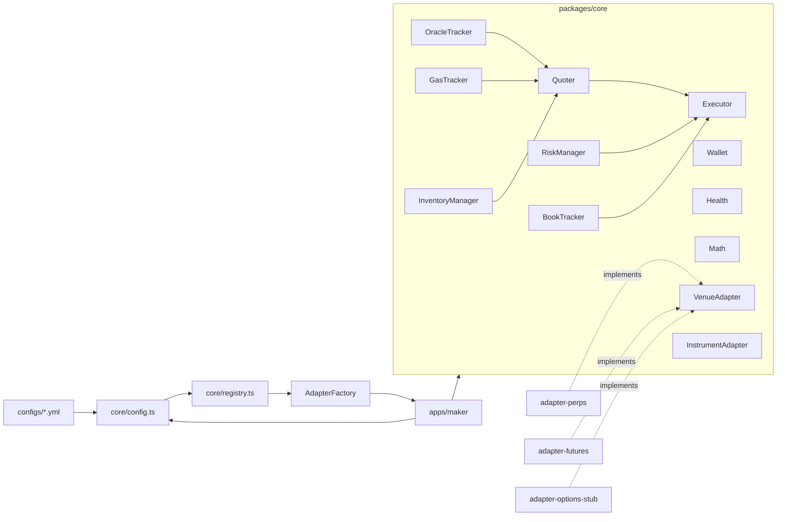

## Why

- The `perps` MM (`/Users/shev/Dev/titan/perps/market-maker/`) is a long-running daemon with cleanly split modules (`quoter`, `orderExecutor`, `bookTracker`, `inventoryManager`, `riskManager`, `gasTracker`, `oracleTracker`, `healthcheck`, `collateral`), Hardhat e2e tests and a `/start` `/stop` health API.
- The `futures-marketplace` MM (`/Users/shev/Dev/titan/futures-marketplace/market-maker/`) is a Lambda one-shot that lacks all of those features and has dead `risk.ts` code, but it owns one feature perps doesn't: a delivery-date-aware Avellaneda–Stoikov reservation price plus geometric taper sizing.
- Both already use the same stack (TS + viem + single on-chain CLOB). Open-source MMs (Hummingbot, Vertex/Hyperliquid samples, Avellaneda reference repos) are a worse fit than refactoring what we already have.

## Target shape (inside `perps` repo)

Convert `market-maker/` into a pnpm workspace with **one executable** and a pluggable adapter registry:

```
market-maker/
  pnpm-workspace.yaml
  packages/
    core/                   # venue-agnostic logic, interfaces, YAML config loader, adapter registry
    adapter-perps/          # HashPowerPerpsDEX bindings, permit collateral, ABIs
    adapter-futures/        # Futures bindings, addMargin collateral, delivery info, ABIs
    adapter-options-stub/   # placeholder interface only - architecture slot for future options venue
  apps/
    maker/                  # the ONE executable. Reads MAKER_CONFIG yaml and dispatches to an adapter
      src/index.ts
      Dockerfile
  configs/
    perps.yml               # runtime config for the perps deployment
    futures.yml             # runtime config for the futures deployment
    options.example.yml     # example - not deployed
  scripts/
    sync-perps-abi.sh
    sync-futures-abi.sh     # copies ABI from sibling ../futures-marketplace checkout
```



## Adapter interfaces (in `packages/core/src/adapter.ts`)

To keep the design options-ready, split into **two levels**. Perps and futures each have exactly one instrument per venue; an options venue would expose many instruments from the same venue. The quoter and executor operate per-instrument; the venue owns the shared wallet, multicall, and collateral.

**`VenueAdapter`** (one per deployment):

- `kind: "perps" | "futures" | "options"` — discriminator for config routing
- `wallet: WalletContext` — injected from core via the wallet registry, looked up by `venue.wallet` name; the adapter never reads a private key
- `listInstruments(): Promise<InstrumentAdapter[]>` — perps/futures return a singleton; options returns one per strike/expiry
- `getCollateral(): Promise<{ free: bigint; maintenanceMargin: bigint }>`
- `topUpCollateral(amount)` — perps uses `addCollateralWithPermit`; futures uses `approve + addMargin`
- `multicall(calls, opts)` — batches cancels/creates across instruments when the venue supports it
- `subscribeVenueEvents(cb): Unsubscribe` — own-order/position events. **All adapters use `watchContractEvent` against the venue contract**; both perps (`OrderCreated/Cancelled/Updated/Matched`) and futures (`OrderCreated/OrderClosed/PositionCreated/PositionClosed/PositionExited`, confirmed in [`contracts/contracts/Futures.sol`](../futures-marketplace/contracts/contracts/Futures.sol) lines 108-132) emit suitable events. No indexer/subgraph dependency.

**`InstrumentAdapter`** (one per quotable market on a venue):

- `id: string` — e.g. `"perps:HP-ARB"` or `"options:BTC-25DEC-50000-C"`
- `getIndexPrice(): Promise<bigint>`
- `getMinTick(): Promise<bigint>`
- `getOwnOrders(): Promise<OwnOrder[]>`
- `getPosition(): Promise<Position>`
- `buildCancelCalldata(orderId)` / `buildCreateCalldata(price, qty)`
- Optional `getContext(): Promise<InstrumentContext>` — exposes venue-specific hints like `deliveryDate`, `expiry`, `strike`, `isCall`, `underlyingSpot`, `contractMultiplier`. Pricing strategies consume this instead of casting.

Two pluggable strategies in `core` keyed off `InstrumentContext`:

- `PricingStrategy`: default `EffectiveSpreadQuoter` (today's perps logic) and new `ReservationPriceQuoter` (today's futures Avellaneda–Stoikov in [`market-maker/helpers.ts`](market-maker/helpers.ts) `calculateReservationPrice`, with `remainingTime` from `InstrumentContext.deliveryDate`). A future `BlackScholesQuoter` for options would slot in the same way.
- `LevelSizing`: `LinearLevels` (today's perps `baseQuantity * (level+1)`) and `GeometricTaperLevels` (today's futures `geometricTaperAllocations`).

## Wallets

Configurable as a registry — one wallet, many wallets, whatever the deployment needs. Top-level `wallets:` map in YAML; each entry has a name and a `${VAR}` reference for the private key (so secrets stay in env). Each `venue` declares `wallet: <name>`. If two venues reference the same name they share the EOA and collateral; if they reference different names they are isolated. Core builds a `WalletRegistry` once at startup (each name → one `privateKeyToAccount` call → one `WalletContext`), then hands the matching context to each venue's factory.

```yaml
wallets:
  default: { privateKey: ${MAKER_PRIVATE_KEY} }
  futuresHot: { privateKey: ${FUTURES_PRIVATE_KEY} }
venue:
  kind: futures
  wallet: futuresHot     # or "default" to share with another venue
```

If only one wallet is used, the YAML can just declare `wallets.default` and every venue references it.

## YAML runtime config

Schema lives in `packages/core/src/config.ts` (typebox + ajv - the same stack futures MM already uses). Config path comes from CLI `--config` or `MAKER_CONFIG` env. `${VAR}` tokens are expanded from `process.env` before validation so secrets stay out of the file.

Example `configs/perps.yml`:

```yaml
wallets:
  default:
    privateKey: ${MAKER_PRIVATE_KEY}
network:
  name: arbitrum
  rpcUrl: ${ETH_NODE_ADDRESS}
  ethPriceFeed: "0x..." # optional Chainlink feed
venue:
  kind: perps
  wallet: default
  address: ${PERPS_ADDRESS}
pricing:
  strategy: effective-spread
  minSpreadBps: 10
  volatilityMultiplier: 2.0
  inventorySkewGamma: 0.5
  maxSkewTicks: 20
sizing:
  strategy: linear
  baseQuantity: "1000000"
  numLevelsPerSide: 5
risk:
  maxPositionSize: "50000000"
  dailyLossLimitUsd: 500
  minCollateralUsd: 50
  gasBudgetHourlyUsd: 20
  gasBudgetDailyUsd: 200
gas:
  maxGasPriceGwei: 2
timing:
  pollIntervalMs: 1000
  requoteThresholdTicks: 2
  requoteCooldownMs: 3000
  resyncIntervalMs: 60000
health:
  port: 8080
dryRun: false
logLevel: info
```

Example `configs/futures.yml` differs by `venue.kind: futures`, `pricing.strategy: reservation-price` (with `riskAversion`, `volatilityWindowHours`), and `sizing.strategy: geometric-taper` (with `taperRatio`). No subgraph fields — futures uses the same on-chain `watchContractEvent` path as perps.

`configs/options.example.yml` exists only to show the shape of a multi-instrument venue (`venue.kind: options`, list of expiries/strikes) - not runnable.

## Numeric model: bigint + Fraction

All on-chain values arrive as `bigint` (wei, USDC base units, ticks) and must stay `bigint` end-to-end. Anywhere today's code reaches for `Number(...)` — most notably [`market-maker/src/oracleTracker.ts`](market-maker/src/oracleTracker.ts) (`Number(price)`, log returns), [`market-maker/src/math.ts`](market-maker/src/math.ts) (`RollingWindow.volatility()`), and `realizedVolatility` / `geometricTaperAllocations` ported from futures — gets rewritten on the `Fraction` type from **[`fraction.js`](https://github.com/rawify/Fraction.js)** (BigInt numerator+denominator, ESM, TS types, MIT, ~14M weekly downloads).

Why fraction.js over rolling our own or using a decimal library:

- Battle-tested, exact rational semantics (`Fraction(a, b)` with bigint internals).
- Built-in `add`/`sub`/`mul`/`div`/`mod`/`abs`/`neg`/`compare`/`equals`/`gcd`/`pow(intExp)` — covers ~95% of what we need.
- Single dependency; smaller surface area than mathjs / decimal.js.

For the small set of irrational results (vol math), add `packages/core/src/rational-approx.ts` (~80 lines):

```ts
import Fraction from "fraction.js";

export function sqrt(x: Fraction, precisionBits: number): Fraction; // bigint Newton iteration
export function ln(x: Fraction, precisionBits: number): Fraction; // atanh series on (x-1)/(x+1)
```

`fraction.js` `pow` returns `null` for non-integer exponents; we never call it that way — we use `Fraction.pow(bigint)` for repeated squaring (geometric taper) and our `ln`/`sqrt` for vol.

Rules:

- Prices, quantities, ticks → raw `bigint`.
- Spreads, bps multipliers, skew, vol, gas-USD ratios → `Fraction`.
- Pricing strategies operate on `Fraction`, then quantize once to tick at the very end via a `toBigint(scale, rounding)` helper.
- No `Number` in the hot loop. `Number` is allowed only at the IO boundary (logs, healthcheck JSON, metrics).
- `RollingWindow` becomes `Bucket<Fraction>`; vol = `sqrt(mean(squared log returns))` using the helpers above (precision configurable, default ~30 bits — plenty for vol estimation).

Test strategy: property tests (`fast-check`) compare every wrapped op against `Number` for inputs in plausible ranges (e.g. prices `1e6..1e14`, bps `0..10000`) and assert relative error below an explicit threshold for `sqrt`/`ln` (exact equality elsewhere).

If `sqrt`/`ln` precision ever feels limiting, swapping in `decimal.js` for those two helpers is a one-file change because they're isolated behind `rational-approx.ts`.

## What moves where

- `market-maker/src/{quoter,orderExecutor,bookTracker,inventoryManager,riskManager,gasTracker,oracleTracker,healthcheck,math,errSerializer,collateral}.ts` → `packages/core/src/`. Strip direct `hashPowerPerpsDexAbi` / `perpsAddress` references and route through `VenueAdapter` / `InstrumentAdapter`. `Quoter` and `OrderExecutor` become instrument-scoped; a thin `PortfolioRunner` in core iterates over `venue.listInstruments()` (singleton today, many for options tomorrow).
- `market-maker/src/{client,abi}.ts` and the event/permit specifics of `bookTracker.ts` and `collateral.ts` → `packages/adapter-perps/src/`. Register via `registerAdapter("perps", perpsAdapterFactory)`.
- `market-maker/src/index.ts` is **replaced** by `apps/maker/src/index.ts` (~80 lines): parse `--config`, load YAML, expand env, validate schema, derive `WalletContext`, look up the adapter factory, start health server, run the poll loop.
- `market-maker/tests/` split: pure logic tests go to `packages/core/tests`; viem/contract tests (`bookTracker`, `inventoryManager`, the e2e and process tests) go to `packages/adapter-perps/tests`.
- From the futures repo, port these into `packages/adapter-futures` and `packages/core`:
  - Pricing math from [`futures-marketplace/market-maker/helpers.ts`](../futures-marketplace/market-maker/helpers.ts) (`calculateReservationPrice`, `geometricTaperAllocations`, `realizedVolatility`, `resampleHourlyClose`, `calculateOrders`) into core as the new strategy plugins, **rewritten on `Fraction`**. Keep the existing unit tests, retargeted to the new API.
  - Contract bindings from [`futures-marketplace/market-maker/contract.ts`](../futures-marketplace/market-maker/contract.ts) into `adapter-futures` (use `createOrder` via `multicall`, `approve + addMargin`, `getDeliveryDates`, `deliveryDurationDays` as `multiplier` - exposed via `InstrumentAdapter.getContext()`).
  - **Drop the subgraph clients.** `getOwnOrders`/`getPosition` are sourced from `watchContractEvent` on `OrderCreated/OrderClosed/PositionCreated/PositionClosed/PositionExited` plus an initial bootstrap read of any "list" view function on the contract (or a one-shot historical event scan from a configurable `fromBlock`). Historical vol for the reservation price warm-up uses the same approach: scan past oracle / index-price events on the venue itself instead of the oracles subgraph.
- `packages/adapter-options-stub/src/index.ts`: exports `OptionsVenueAdapter` where every method throws `NotImplementedError`, plus a README sketching how strikes/expiries map to instruments and what `InstrumentContext` fields a Black-Scholes quoter would need. Registered under `registerAdapter("options", stubFactory)` so the config loader errors with "options adapter not yet implemented" instead of "unknown kind".
- ABIs: vendored under each adapter (`packages/adapter-perps/abi/`, `packages/adapter-futures/abi/`) and refreshed by the `sync-*-abi.sh` scripts (no auto-sync).

## Deploy / CI changes

In `perps` repo:

- Single [`apps/maker/Dockerfile`](market-maker/apps/maker/Dockerfile) (multi-stage Node 22 Alpine). `COPY configs/ /app/configs/` bakes both config files into the image. `CMD ["node", "apps/maker/dist/index.js", "--config", "/app/configs/perps.yml"]` is the default; ECS task definitions override `command` (or pass `MAKER_CONFIG`) to pick `futures.yml`.
- [`.github/workflows/deploy-market-maker.yml`](.github/workflows/deploy-market-maker.yml) builds and pushes **one** image, e.g. `ghcr.io/lumerin-protocol/titan-market-maker:<sha>`.
- Update [`.bedrock/.terragrunt/04_market_maker_svc.tf`](.bedrock/.terragrunt/04_market_maker_svc.tf) to set `MAKER_CONFIG=/app/configs/perps.yml` and pass `MAKER_PRIVATE_KEY`, `ETH_NODE_ADDRESS`, `PERPS_ADDRESS` as env vars. [`.github/workflows/market-maker-tests.yml`](.github/workflows/market-maker-tests.yml) runs `pnpm -r test`.

In `futures-marketplace` repo:

- Delete the entire `market-maker/` package and its workflows ([`test-market-maker.yml`](../futures-marketplace/.github/workflows/test-market-maker.yml), `deploy-market-maker.yml`).
- Replace the Lambda Terraform [`.bedrock/.terragrunt/10_market_maker_lambda.tf`](../futures-marketplace/.bedrock/.terragrunt/10_market_maker_lambda.tf) with an ECS service module that pulls `ghcr.io/lumerin-protocol/titan-market-maker:<pinned>` and sets `MAKER_CONFIG=/app/configs/futures.yml` plus the usual secrets. If the futures AWS account differs from perps, keep the service resource in this repo; only the image source moves.
- Update `.bedrock/README.md` to reflect ECS deploy.
- `copytrade.ts` utility: out of scope for this unification; leave in place and file a follow-up for its hardcoded Alchemy URLs.

## Open items called out for review

- **Initial state bootstrap on reorg-prone chains:** events alone don't give you "the state at startup" without scanning history. Default plan: on boot, do a single bounded historical scan from `venue.eventsFromBlock` (configurable; default = `latest - N`) using `getLogs` to seed `BookTracker`/`InventoryManager`, then `watchContractEvent` from `latest`. If the contract has a cheap "list my orders/positions" view, prefer that for bootstrap.
- **Cross-account deploy:** if the futures AWS account and perps AWS account are separate, keep the new ECS Terraform in `futures-marketplace/.bedrock` while the image lives on GHCR; no cross-account IAM needed.
- **Config-in-image vs out-of-image:** baking `configs/*.yml` into the image is simplest but means rebuilds for parameter tuning. If ops wants faster iteration, switch to SSM/S3-fetched config in a follow-up; the loader already abstracts source behind a single path.
- **Rational precision:** `ln`/`sqrt` in `rational-approx.ts` need a precision setting. Default ~30 fractional bits is plenty for vol but is exposed via config in case a strategy needs more. If we ever want more, swap that one file to delegate to `decimal.js`.
