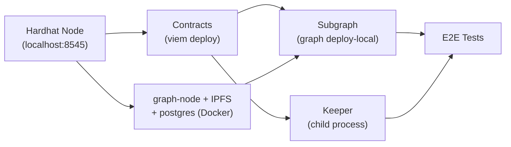

# E2E Local Stack Setup

## Problem & Approach

Three services need to boot in order, share contract addresses, and be tested together:



## Step 1: Consolidate Fixtures

The viem-based deployment logic in `keeper/tests/fixture.ts` is the right foundation for E2E (it targets an external node, not an in-process Hardhat environment). Move it to the contracts package so both keeper tests and the new e2e tests can import it without creating a backwards dependency.

- Move `keeper/tests/fixture.ts` → `**contracts/fixtures/viem.ts**`
- Move `keeper/tests/helpers.ts` (node lifecycle, client factories, `waitFor`, `loadFixture`) → `**contracts/fixtures/helpers.ts**`
- Keep `contracts/tests/fixtures.ts` as-is (it uses `@nomicfoundation/hardhat-*` and serves the unit tests)
- Update `keeper/tests/keeper.e2e.test.ts` import paths to the new location
- The `contracts` package already has `viem` as a dependency via wagmi/hardhat

## Step 2: Create `e2e/` Package

```
e2e/
├── package.json            # scripts: test, stack:up, stack:down
├── tsconfig.json
├── setup/
│   ├── hardhat.ts          # startHardhatNode() — imported from contracts/fixtures/helpers.ts
│   ├── subgraph.ts         # docker compose up/down + wait for graph-node + deploy subgraph
│   └── keeper.ts           # spawn keeper as a child process, wait for health check
└── tests/
    └── full-flow.test.ts   # Node built-in test runner, same as keeper tests
```

`setup/subgraph.ts` key logic:

- Run `docker compose -f ../indexer/docker-compose.yml up -d` with `NETWORK=hardhat` and `ETH_NODE_ADDRESS=host-gateway:8545` (the existing compose file already has `extra_hosts: localhost:host-gateway`)
- Poll `http://localhost:8030/` until graph-node responds
- Run `pnpm --filter indexer setup-local` (which envsubsts the template with the deployed contract address and starts/deploys the subgraph)

`setup/keeper.ts` key logic:

- Spawn the keeper as a child process with env vars pointing to the local Hardhat node and deployed contract address
- Wait for its health check port to respond before proceeding

## Step 3: E2E Test Scenarios

`tests/full-flow.test.ts` tests the full stack end-to-end:

- Create orders on-chain → poll subgraph GraphQL → assert `OrderCreated` entity appears
- Match orders → assert `PositionTrade` entity and position session appear in subgraph
- Trigger liquidation (set oracle price via mock) → wait for keeper to execute → assert `Liquidation` entity in subgraph

## Step 4: `package.json` Scripts

```json
{
  "scripts": {
    "test": "node --test --test-force-exit 'tests/**/*.test.ts'",
    "stack:up": "tsx setup/stack.ts up",
    "stack:down": "tsx setup/stack.ts down"
  }
}
```

Add a root-level `package.json` (or workspace file) `e2e` script if a root manifest exists, or document in README.

## Files Changed

- **Move**: `keeper/tests/fixture.ts` → `contracts/fixtures/viem.ts`
- **Move**: `keeper/tests/helpers.ts` → `contracts/fixtures/helpers.ts`
- **Update**: `keeper/tests/keeper.e2e.test.ts` — update import paths
- **New**: `e2e/package.json`, `e2e/tsconfig.json`
- **New**: `e2e/setup/hardhat.ts`, `e2e/setup/subgraph.ts`, `e2e/setup/keeper.ts`
- **New**: `e2e/tests/full-flow.test.ts`
- `indexer/docker-compose.yml` stays in place (referenced by `e2e/setup/subgraph.ts`)
