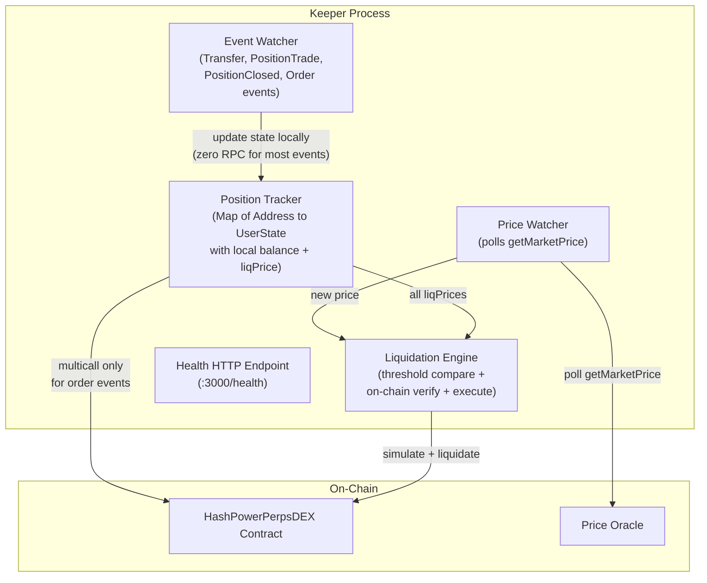

# Perps Liquidation Keeper

An off-chain keeper bot that monitors the [HashPowerPerpsDEX](../contracts/contracts/HashPowerPerpsDEX.sol) perpetuals contract and automatically liquidates under-margined positions. It minimizes RPC usage by maintaining local state from contract events and pre-computing liquidation price thresholds so the main loop only needs a single `getMarketPrice()` call per tick.

## Table of Contents

- [Quick Start](#quick-start)
- [Configuration](#configuration)
- [Architecture](#architecture)
- [How It Works](#how-it-works)
- [Project Structure](#project-structure)
- [Technical Reference](#technical-reference)
- [Health Endpoint](#health-endpoint)
- [Deployment](#deployment)

## Quick Start

### Prerequisites

- Node.js >= 22.18.0
- pnpm 10+
- Access to an EVM-compatible RPC endpoint (WebSocket preferred)
- A funded keeper wallet

### Installation

```bash
cd keeper
pnpm install
```

### Setup

Create a `.env` file in the repository root (shared with `contracts/`):

```bash
# Required
ETH_NODE_ADDRESS=wss://your-rpc-endpoint    # WebSocket preferred; HTTP works with polling
PERPS_ADDRESS=0x...                          # Deployed HashPowerPerpsDEX contract address
KEEPER_PRIVATE_KEY=0x...                     # Keeper wallet private key

# Optional (defaults shown)
POLL_INTERVAL_MS=5000                        # Price check interval
RESYNC_INTERVAL_MS=300000                    # Full position re-sync interval (5 min)
DRY_RUN=false                                # Log liquidations without executing
MIN_PROFIT_MARGIN=0                          # Minimum profit in collateral token units after gas
HEALTH_PORT=3000                             # Health endpoint port
```

### Running

```bash
# Development (with pretty-printed logs)
pnpm dev

# Development in dry-run mode (no transactions sent)
pnpm dev:dry

# Production
pnpm start

# Type check
pnpm typecheck
```

## Configuration

| Variable | Required | Default | Description |
| --- | --- | --- | --- |
| `ETH_NODE_ADDRESS` | Yes | -- | RPC URL. WebSocket preferred for real-time event subscriptions; HTTP falls back to polling. |
| `PERPS_ADDRESS` | Yes | -- | Deployed HashPowerPerpsDEX contract address. |
| `KEEPER_PRIVATE_KEY` | Yes | -- | Private key of the keeper wallet used to submit liquidation transactions. |
| `POLL_INTERVAL_MS` | No | `5000` | How often (ms) to poll `getMarketPrice()` and scan for liquidatable positions. |
| `RESYNC_INTERVAL_MS` | No | `300000` | How often (ms) to perform a full re-sync from on-chain state. Safety net against missed events or reorgs. |
| `DRY_RUN` | No | `false` | When `true`, liquidation candidates are logged but no transactions are submitted. |
| `MIN_PROFIT_MARGIN` | No | `0` | Minimum profit (in collateral token units) after gas costs for a liquidation to be executed. |
| `HEALTH_PORT` | No | `3000` | Port for the HTTP health check endpoint. |

## Architecture



### Core Design: Pre-computed Liquidation Prices

Instead of polling `isLiquidatable()` for every user on every iteration, the keeper pre-computes the exact **liquidation price** for each tracked user. The main loop then only needs to poll `getMarketPrice()` (1 RPC call) and compare the result against stored thresholds -- an O(n) in-memory scan with zero additional RPC calls.

## How It Works

### 1. Startup

Load configuration, create [viem](https://viem.sh/) clients, and read contract parameters (`maintenanceMarginPercent`, `marginPercent`, `liquidationFee`). Seed the position tracker by calling `getUsersWithPositions()`, then multicall `{getUserPosition, balanceOf, getMaintenanceMargin, getMarketPrice}` per user to populate state and compute liquidation prices.

This is the **only time** `balanceOf` is read from the chain -- from this point on, balances are maintained locally via `Transfer` events.

### 2. Event Watching

Real-time event processing via `watchContractEvent`. Events are split into two categories based on RPC cost:

**Zero-RPC events** (state derived entirely from event args):

- **`Transfer(from, to, value)`** -- ERC20 event on the HashPowerPerpsDEX contract. Adjusts local balance (`balance += / -=`) and recomputes `liquidationPrice` locally.
- **`PositionTrade(user, tradePrice, quantity, netQuantityAfter, aggregatedEntryPriceAfter)`** -- Updates `netQuantity` and `entryPrice` directly from args. For **new users** (not yet tracked): reads `balanceOf` + `getMaintenanceMargin` once to initialize.
- **`PositionClosed(user, quantityClosed, pnl)`** -- If the user had no `PositionTrade` in the same block (full offset, no flip): removes the user from the tracker. Otherwise ignored (partial close already handled by PositionTrade).
- **`PositionLiquidated(user, ...)`** -- Removes the user from the tracker immediately.

**Lightweight-RPC events** (need `getMaintenanceMargin` to recompute order margin):

- **`OrderCreated`**, **`OrderCancelled`**, **`OrderFilled`**, **`OrderUpdated`** -- Multicall `{getMaintenanceMargin(user), getMarketPrice()}` (2 reads), back-calculate new `orderMargin`, recompute `liquidationPrice`.

### 3. Price Polling

Every `POLL_INTERVAL_MS` (default 5 s), poll `getMarketPrice()`. On each new price, scan all tracked users:

- **Longs**: liquidatable if `currentPrice <= user.liquidationPrice`
- **Shorts**: liquidatable if `currentPrice >= user.liquidationPrice`

### 4. Liquidation Execution

For each candidate:

1. **Simulate** -- `simulateContract` for `liquidate(user)` as an on-chain safety check (catches any local state drift).
2. **Profitability check** -- `estimateContractGas`, then verify `liquidationFee > gasCost + MIN_PROFIT_MARGIN`.
3. **Execute** -- If profitable and not in dry-run mode: `writeContract` to submit the transaction. In dry-run mode: log the would-be liquidation.
4. **Handle reverts** -- If simulation reverts with `NotLiquidatable`: log a warning and trigger a full state recomputation for this user.

### 5. Periodic Re-sync

Every `RESYNC_INTERVAL_MS` (default 5 min), perform a full re-seed from `getUsersWithPositions()` + multicall per user. This replaces the entire local map and acts as a safety net against missed events, reorgs, or accumulated state drift.

## Project Structure

```
keeper/
  package.json              # viem, pino, typescript
  tsconfig.json
  Dockerfile
  README.md
  src/
    index.ts                # Entry point: init, orchestrate, graceful shutdown
    config.ts               # Env var loading + validation
    client.ts               # viem publicClient + walletClient factory
    abi.ts                  # Contract ABI
    positionTracker.ts      # Mini-indexer: event watchers, Map<Address,UserState>,
                            #   liquidation price computation, seed + resync
    positionHelper.ts       # Pure helper functions for position math
    liquidator.ts           # Price watcher loop, threshold comparison,
                            #   on-chain verify (simulate), profitability, execute/dry-run
    healthcheck.ts          # Node http server on configurable port
```

## Technical Reference

### Per-user State Model

```typescript
interface UserState {
  address: Address;
  // Position
  netQuantity: bigint;     // signed: positive = long, negative = short
  entryPrice: bigint;      // aggregatedEntryPrice
  // Margin
  collateral: bigint;      // balanceOf(user) -- receipt token balance
  orderMargin: bigint;     // back-calculated, independent of price
  // Computed
  liquidationPrice: bigint; // price threshold for liquidation
  isLong: boolean;          // netQuantity > 0
}
```

### Liquidation Price Math

A user is liquidatable when `balanceOf(user) < getMaintenanceMargin(user)`, where:

```
maintenanceMargin = orderMargin + positionMaintenanceMargin(P)

orderMargin = userTotalOrderValue * marginPercent / 100    (independent of price P)

positionMaintenanceMargin(P) =
    (P * |q| / D) * mPct / 100
    + max(0, -unrealizedPnl(P))

unrealizedPnl(P) = (P - entryPrice) * netQuantity / D

where D = 10^6 (QUANTITY_DECIMALS)
```

Solving for price P yields closed-form liquidation thresholds:

**Longs** (netQuantity > 0) -- liquidatable when price drops below:

```
P_liq = (entryPrice * q - (balance - orderMargin) * D) * 100
        / (q * (100 - mPct))
```

**Shorts** (netQuantity < 0, Q = |netQuantity|) -- liquidatable when price rises above:

```
P_liq = (entryPrice * Q + (balance - orderMargin) * D) * 100
        / (Q * (100 + mPct))
```

Implementation (pure function, BigInt math):

```typescript
function computeLiquidationPrice(
  netQuantity: bigint,
  entryPrice: bigint,
  collateral: bigint,
  orderMargin: bigint,
  maintenanceMarginPercent: bigint,
): bigint {
  const D = 10n ** 6n; // QUANTITY_DECIMALS
  const available = collateral - orderMargin;

  if (netQuantity > 0n) {
    // Long: liquidatable when price drops below this
    const numerator = (entryPrice * netQuantity - available * D) * 100n;
    const denominator = netQuantity * (100n - maintenanceMarginPercent);
    return numerator / denominator;
  } else {
    // Short: liquidatable when price rises above this
    const Q = -netQuantity;
    const numerator = (entryPrice * Q + available * D) * 100n;
    const denominator = Q * (100n + maintenanceMarginPercent);
    return numerator / denominator;
  }
}
```

### Order Margin Back-calculation

Since `userTotalOrderValue` is a private contract variable, `orderMargin` is derived from on-chain reads:

```typescript
// Read from contract at current price P:
const maintenanceMargin = await getMaintenanceMargin(user); // total
const marketPrice = await getMarketPrice();

// Compute position component at price P ourselves:
const posValue = (marketPrice * absQuantity) / D;
const posMaintenance = (posValue * mPct) / 100n;
const pnl = ((marketPrice - entryPrice) * netQuantity) / D;
const unrealizedLoss = pnl < 0n ? -pnl : 0n;
const positionComponent = posMaintenance + unrealizedLoss;

// Back-calculate:
const orderMargin = maintenanceMargin - positionComponent;
```

This value is cached and remains valid until the user's orders change (triggered by Order events). For `Transfer` and `PositionTrade` events, the cached `orderMargin` is reused with zero RPC.

### RPC Call Summary

| Trigger | RPC Calls | Notes |
| --- | --- | --- |
| Startup / resync | `getUsersWithPositions` + per-user multicall of 4 | One-time seed |
| Transfer event | 0 | Balance from event args |
| PositionTrade event (existing user) | 0 | Position from event args |
| PositionTrade event (new user) | 2 | `balanceOf` + `getMaintenanceMargin` to initialize |
| PositionClosed / PositionLiquidated | 0 | Remove from map |
| Order events | 2 | `getMaintenanceMargin` + `getMarketPrice` |
| Price poll (main loop) | 1 | `getMarketPrice` |
| Liquidation attempt | 1-2 | `simulateContract` + `writeContract` |

### Contract Interface

All interactions target the [HashPowerPerpsDEX](../contracts/contracts/HashPowerPerpsDEX.sol) contract. ABI is available at `src/abi.ts`.

**Read functions:**

| Function | Used In |
| --- | --- |
| `getUsersWithPositions()` | Startup, resync |
| `getUserPosition(user)` | Startup, resync |
| `balanceOf(user)` | Startup, resync, new-user init |
| `getMaintenanceMargin(user)` | Startup, resync, order events, new-user init |
| `getMarketPrice()` | Price polling, order-event back-calculation |
| `maintenanceMarginPercent()` | Startup (contract params) |
| `marginPercent()` | Startup (contract params) |
| `liquidationFee()` | Startup (contract params) |

**Write functions:**

| Function | Used In |
| --- | --- |
| `liquidate(address)` | Liquidation execution (via `simulateContract` then `writeContract`) |

**Events watched:**

| Event | Signature |
| --- | --- |
| `Transfer` | `Transfer(from, to, value)` |
| `PositionTrade` | `PositionTrade(user, tradePrice, quantity, netQuantityAfter, aggregatedEntryPriceAfter)` |
| `PositionClosed` | `PositionClosed(user, quantityClosed, pnl)` |
| `PositionLiquidated` | `PositionLiquidated(user, liquidator, positionSize, pnl, liquidatorFee)` |
| `OrderCreated` | `OrderCreated(orderId, participant, price, quantity)` |
| `OrderCancelled` | `OrderCancelled(orderId, participant)` |
| `OrderFilled` | `OrderFilled(orderId, participant)` |
| `OrderUpdated` | `OrderUpdated(orderId, participant, newQuantity)` |

## Health Endpoint

`GET /health` on port `HEALTH_PORT` (default 3000) returns:

```json
{
  "status": "running",
  "trackedPositions": 42,
  "lastPriceCheckAt": "2026-02-11T12:00:00.000Z",
  "lastPrice": "50000000000",
  "liquidationsExecuted": 3,
  "uptimeSeconds": 3600,
  "dryRun": false
}
```

## Deployment

### Docker

```bash
# Build and run (reads .env from repo root)
pnpm docker

# Or manually:
docker build -t perps-keeper .
docker run --rm --env-file ../.env perps-keeper
```
