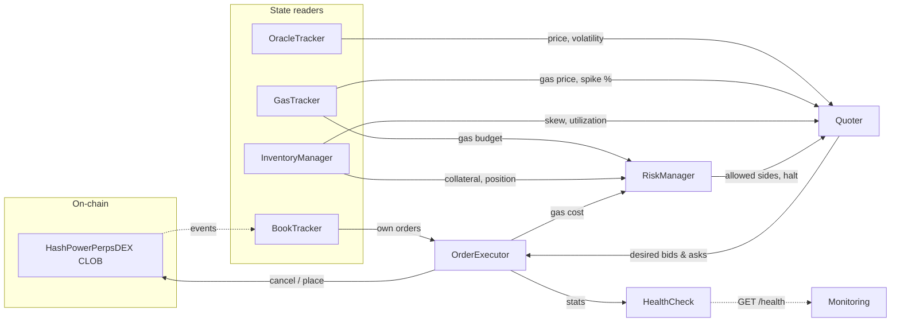

# Perps Market Maker

Automated market maker for the HashPowerPerpsDEX on-chain CLOB. Provides two-sided liquidity by placing layered limit orders around the oracle price, dynamically adjusting quotes based on inventory, volatility, and gas conditions.

## Architecture

The bot runs a single poll loop (`tick`) that reads on-chain state, computes desired quotes, and reconciles them against resting orders.



### Components

| Component | File | Role |
|---|---|---|
| **OracleTracker** | `oracleTracker.ts` | Reads `getMarketPrice()` each tick; tracks rolling volatility |
| **GasTracker** | `gasTracker.ts` | Reads gas price, detects spikes, estimates tx costs in USD via ETH price feed |
| **BookTracker** | `bookTracker.ts` | Maintains local mirror of order book via `getOrderBookPrices()` + event watching; tracks own orders |
| **InventoryManager** | `inventoryManager.ts` | Reads `getUserPosition()`, `balanceOf()`, `getMaintenanceMargin()` to track net exposure and utilization |
| **RiskManager** | `riskManager.ts` | Drawdown circuit breaker, daily loss limit, gas budget throttling, position limit enforcement |
| **Quoter** | `quoter.ts` | Computes bid/ask levels: Avellaneda-Stoikov inspired spreads with gas floor, volatility scaling, inventory skew |
| **OrderExecutor** | `orderExecutor.ts` | Diffs desired quotes vs resting orders; cancels stale, places new; gas-capped transactions |
| **HealthCheck** | `healthcheck.ts` | HTTP `/health` endpoint exposing live operational metrics |

### Tick cycle

Each iteration:

1. **Update** oracle price, gas price, order book, inventory
2. **Risk check** — halt if collateral below minimum or daily loss exceeded; throttle if gas budget exceeded
3. **Compute quotes** — N levels per side, spread = max(minSpreadBps, gasFloor) + volatility + inventory skew + gas penalty
4. **Reconcile** — selective requoting: only cancel/place orders that changed; skips requote if price drift is below threshold or cooldown hasn't elapsed; skips non-urgent requotes during gas spikes

### Quoting strategy

- **Base spread**: configurable minimum in basis points (`minSpreadBps`)
- **Gas floor**: minimum spread to break even on round-trip gas costs (cancel + place)
- **Volatility component**: `volatilityMultiplier * rollingVolatility * 10000` bps
- **Inventory skew**: shifts both bid and ask toward reducing exposure; controlled by `inventorySkewGamma` and `maxSkewTicks`
- **Gas spike penalty**: widens spread proportionally when gas exceeds median by `gasSpikeThresholdPct`
- **Level sizing**: deeper levels get progressively larger quantities (`baseQuantity * level`)

### Risk controls

- **Position limits**: max net position size; blocks the side that would increase exposure
- **Utilization cap**: when `requiredMargin / collateral` exceeds `maxUtilizationPct`, only quotes the reducing side
- **Drawdown halt**: stops quoting and cancels all orders if collateral drops below `minCollateralBalance`
- **Daily loss halt**: includes gas costs in PnL calculation; halts if daily loss exceeds `maxDailyLossUsd`
- **Gas budget throttle**: rolling hourly/daily gas budgets; when exceeded, requote cooldown and threshold increase (3x and 2x)
- **Gas spike deferral**: during gas spikes, requotes are deferred unless price drift exceeds `urgentRequoteThresholdTicks`
- **Gas cap**: `maxFeePerGas` is capped at `gasCapMultiplier * medianGasPrice`

### Graceful shutdown

On `SIGINT` / `SIGTERM`, the bot cancels all resting orders before exiting.

## Configuration

All configuration is via environment variables. Create a `.env` file in the repo root (loaded via `--env-file`).

### Required

| Variable | Description |
|---|---|
| `NETWORK` | Chain identifier: `arbitrum`, `arbitrum-sepolia`, or `hardhat` |
| `ETH_NODE_ADDRESS` | RPC endpoint (HTTP or WebSocket) |
| `PERPS_ADDRESS` | Deployed HashPowerPerpsDEX proxy contract address |
| `MAKER_PRIVATE_KEY` | Hex-encoded private key for the MM wallet |

### Quoting

| Variable | Default | Description |
|---|---|---|
| `MAKER_LEVELS_PER_SIDE` | `5` | Number of bid/ask levels to quote |
| `MAKER_BASE_QUANTITY` | `1000000` | Base order size (in quantity decimals) |
| `MAKER_MIN_SPREAD_BPS` | `10` | Minimum spread in basis points |
| `MAKER_VOLATILITY_MULTIPLIER` | `2.0` | Volatility scaling factor |
| `MAKER_INVENTORY_SKEW_GAMMA` | `0.5` | Inventory skew strength (0 = disabled, 1 = max) |
| `MAKER_MAX_SKEW_TICKS` | `20` | Maximum skew offset in tick units |

### Gas management

| Variable | Default | Description |
|---|---|---|
| `ETH_PRICE_FEED_ADDRESS` | *(none)* | Chainlink ETH/USD price feed address (enables USD gas cost tracking) |
| `MAKER_GAS_SPIKE_THRESHOLD_PCT` | `200` | Gas price % above median to trigger spike mode |
| `MAKER_GAS_CAP_MULTIPLIER` | `2.0` | Max gas price as multiple of median |
| `MAKER_GAS_PENALTY_BPS` | `5` | Additional spread penalty per 100% gas spike |
| `MAKER_MAX_GAS_BUDGET_HOUR_USD` | `50000000` | Max gas spend per rolling hour (collateral decimals) |
| `MAKER_MAX_GAS_BUDGET_DAY_USD` | `500000000` | Max gas spend per rolling day (collateral decimals) |
| `MAKER_URGENT_REQUOTE_TICKS` | `10` | Price drift in ticks that overrides gas spike deferral |

### Risk

| Variable | Default | Description |
|---|---|---|
| `MAKER_MAX_POSITION_SIZE` | `100000000` | Max absolute net position (quantity decimals) |
| `MAKER_MAX_UTILIZATION_PCT` | `80` | Max margin utilization before side restrictions |
| `MAKER_MIN_COLLATERAL` | `100000000` | Minimum collateral balance before halt (collateral decimals) |
| `MAKER_MAX_DAILY_LOSS_USD` | `1000000000` | Max daily loss including gas (collateral decimals) |

### Timing

| Variable | Default | Description |
|---|---|---|
| `MAKER_POLL_INTERVAL_MS` | `3000` | Main loop interval |
| `MAKER_REQUOTE_THRESHOLD_TICKS` | `2` | Price drift in ticks before requoting |
| `MAKER_REQUOTE_COOLDOWN_MS` | `1000` | Minimum time between requotes |
| `MAKER_RESYNC_INTERVAL_MS` | `60000` | Full order book resync interval |

### Operational

| Variable | Default | Description |
|---|---|---|
| `MAKER_DRY_RUN` | `false` | Log orders without submitting transactions |
| `MAKER_HEALTH_PORT` | `3001` | HTTP health endpoint port |
| `MAKER_LOG_LEVEL` | `info` | Pino log level: `trace`, `debug`, `info`, `warn`, `error`, `silent` |

## Getting started

### Prerequisites

- Node.js >= 22.6.0
- pnpm >= 10
- Compiled contracts (ABIs)

### Install

```bash
cd market-maker
pnpm install
```

### Build ABIs

The market maker uses ABIs generated from the contracts package. The `pretest` script handles this automatically for tests, but for manual setup:

```bash
cd contracts
pnpm hardhat compile
cp abi/abi.ts ../market-maker/src/abi.ts
```

### Run

```bash
# Production (reads .env from repo root)
pnpm start

# Development with pretty-printed logs
pnpm dev

# Dry run (no transactions, logs what would happen)
pnpm dev:dry
```

### Example `.env`

```env
NETWORK=arbitrum-sepolia
ETH_NODE_ADDRESS=https://sepolia-rollup.arbitrum.io/rpc
PERPS_ADDRESS=0x...
MAKER_PRIVATE_KEY=0x...

MAKER_LEVELS_PER_SIDE=3
MAKER_BASE_QUANTITY=1000000
MAKER_MIN_SPREAD_BPS=30
MAKER_POLL_INTERVAL_MS=5000
MAKER_MAX_POSITION_SIZE=50000000
MAKER_DRY_RUN=false
MAKER_HEALTH_PORT=3001
```

## Health endpoint

`GET http://localhost:{MAKER_HEALTH_PORT}/health` returns JSON:

```json
{
  "status": "running",
  "haltReason": "none",
  "throttled": false,
  "throttleReason": "none",
  "oraclePrice": "2997635",
  "volatility": 0.0012,
  "netPosition": "-1000000",
  "collateral": "100000000000",
  "inventorySkew": -0.01,
  "utilizationPct": 5,
  "ownOrders": 6,
  "bestBid": "2990000",
  "bestAsk": "3010000",
  "gasGwei": "0.10",
  "gasSpiking": false,
  "gasSpikePct": "0",
  "cumulativeGasCostUsd": "0",
  "tickCount": 142,
  "lastTickAt": 1709500000000,
  "ordersPlaced": 12,
  "ordersCancelled": 6,
  "reconcileCount": 3,
  "uptimeSeconds": 426,
  "dryRun": false
}
```

| Field | Description |
|---|---|
| `status` | `running` or `halted` |
| `haltReason` | `none`, `drawdown`, or `daily_loss` |
| `throttled` | Whether gas budget throttling is active |
| `oraclePrice` | Current oracle price (contract decimals) |
| `volatility` | Rolling price volatility (0-1 scale) |
| `netPosition` | Signed net position size |
| `collateral` | Collateral balance (collateral token decimals) |
| `inventorySkew` | Position skew ratio (-1 to 1) |
| `utilizationPct` | Margin utilization percentage |
| `ownOrders` | Number of resting orders on-chain |
| `bestBid` / `bestAsk` | Current top-of-book prices |
| `ordersPlaced` / `ordersCancelled` | Cumulative order counts since startup |
| `reconcileCount` | Number of requote cycles executed |

## Testing

```bash
# Run all tests (unit + e2e)
pnpm test

# With coverage report
pnpm test:coverage

# Watch mode
pnpm test:watch

# Run only process-level e2e tests
node --test --test-force-exit --test-concurrency=1 'tests/market-maker.process.test.ts'
```

Tests use a local Hardhat node started automatically. The test suite includes:

- **Unit tests**: each component tested in isolation with mocked dependencies
- **Component e2e tests** (`market-maker.e2e.test.ts`): full component stack wired together against a local Hardhat node
- **Process e2e tests** (`market-maker.process.test.ts`): spawns the market maker as a separate OS process, verifies behavior by querying on-chain state and the health API

## Supported networks

| Network | Chain ID | Notes |
|---|---|---|
| `arbitrum` | 42161 | Production |
| `arbitrum-sepolia` | 421614 | Testnet |
| `hardhat` | 31337 | Local development |

Transport is selected automatically: WebSocket URLs (`ws://` / `wss://`) use WebSocket transport, otherwise HTTP.
